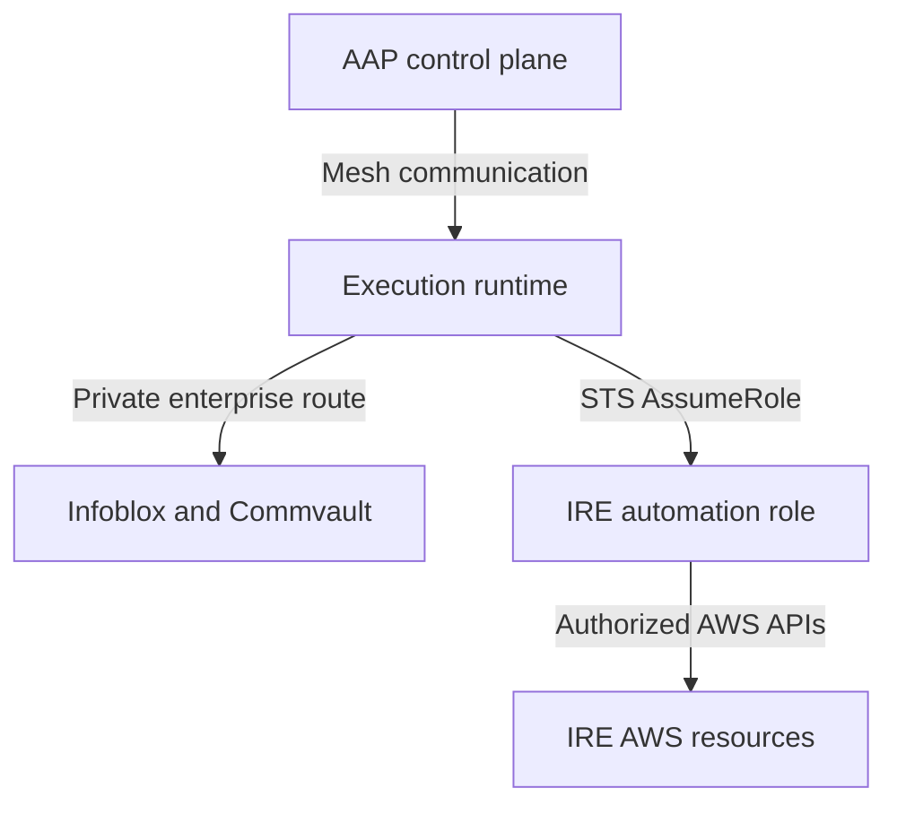
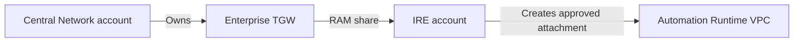
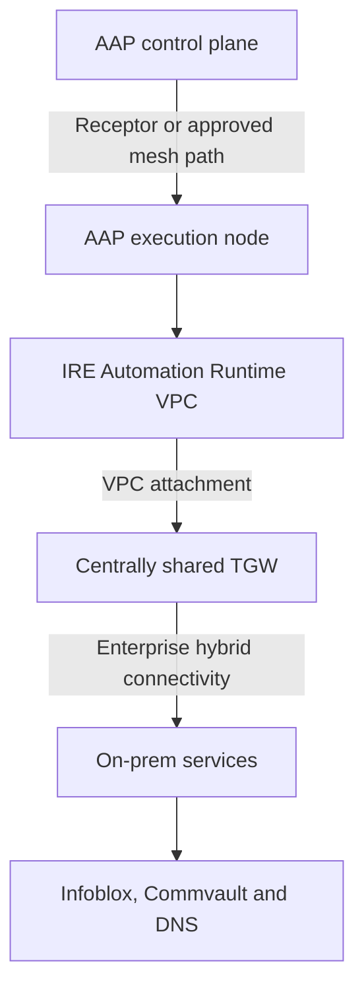
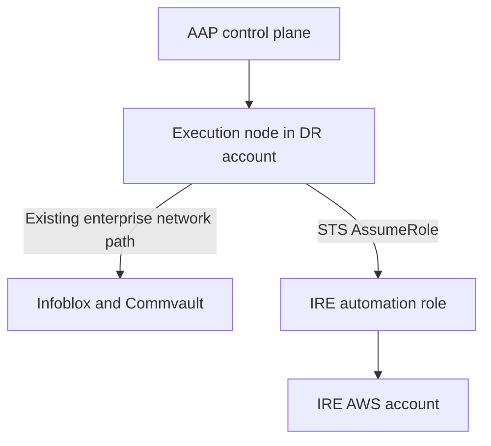
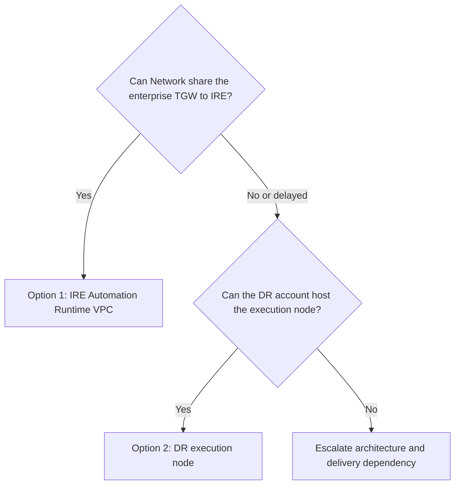
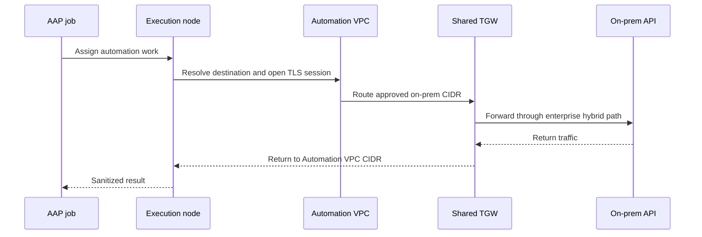
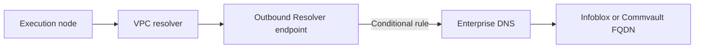
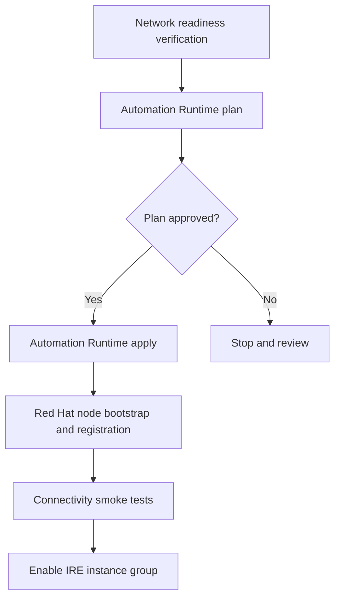
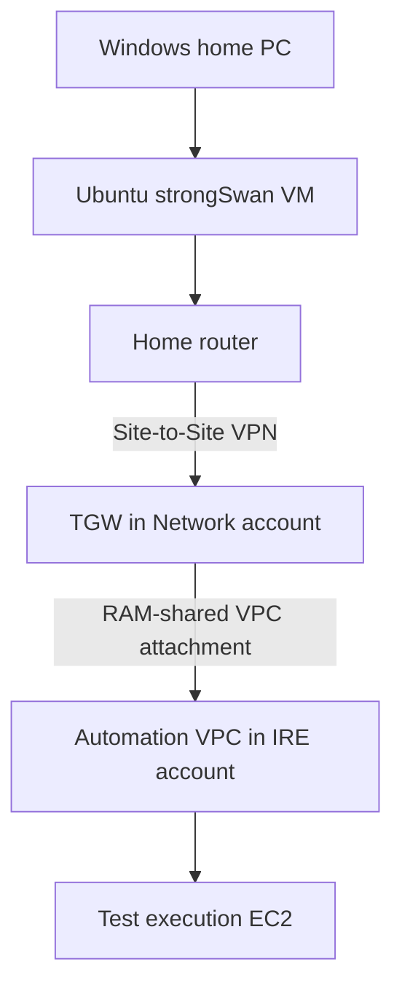
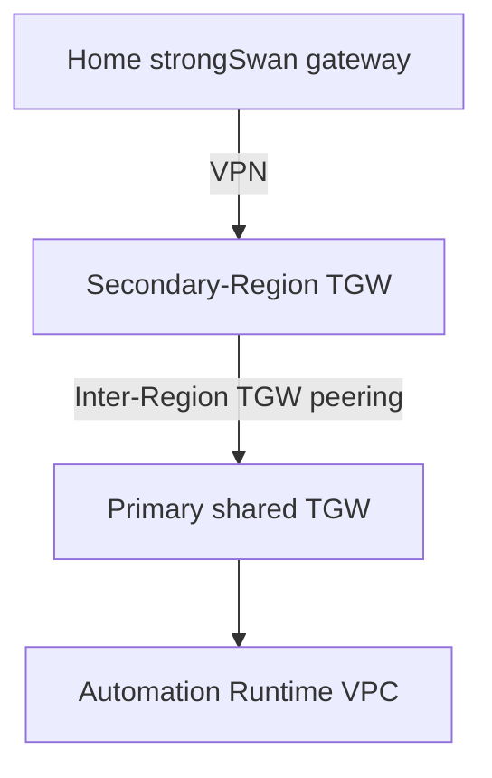

# IRE Automation Runtime and Enterprise Connectivity Options

**Status:** Under Review  
**Audience:** IRE Architecture, Enterprise Network, Cloud Platform, Cyber Security, Red Hat/AAP, IAM, Infoblox, Commvault and DR Operations  
**Purpose:** Define how an Ansible Automation Platform execution runtime can privately reach enterprise Infoblox and Commvault services without weakening IRE isolation or coupling the automation control path to disposable recovery infrastructure.

---

## 1. Executive summary

Red Hat requires compute with private connectivity to on-premises Infoblox and Commvault APIs. The IRE account currently has no Site-to-Site VPN, Direct Connect path or other enterprise connectivity. The existing DR account appears to reach on-premises through a transit gateway owned by a central network account.

The strategic recommendation is:

> Deploy a dedicated, long-lived **Automation Runtime VPC** in the IRE account and attach it to the existing centrally owned enterprise Transit Gateway through AWS Resource Access Manager. Restrict routing to approved Infoblox, Commvault and enterprise DNS destinations. Keep this VPC independent from the disposable IRE Platform, Identity, Remote Access and Recovery lifecycles.

The pragmatic interim option is:

> Place or reuse an AAP execution node in the existing DR/shared-services account that already has enterprise connectivity, and let its AAP jobs assume the IRE automation role for AWS operations.

The execution node location and AWS authorization are separate concerns. An execution node can run in another account while assuming a narrowly scoped role in the IRE account.

The proposal is **not** to create a new IRE Site-to-Site VPN unless Enterprise Network determines that the shared-TGW pattern cannot be used.

---

## 2. Problem statement

The AAP control plane can orchestrate jobs, but the process executing an Infoblox or Commvault module must have network reachability to the target API endpoint. IAM permissions and AWS `AssumeRole` do not create that network path.

Three distinct requirements must therefore be solved:

1. **AAP mesh connectivity:** the AAP control plane must communicate with the execution runtime.
2. **Enterprise API connectivity:** the execution runtime must resolve and connect to Infoblox and Commvault endpoints.
3. **AWS authorization:** the job must assume the approved IRE automation role to call AWS APIs.

These requirements should be designed independently and then combined through AAP orchestration.



---

## 3. Architecture principles

### 3.1 Preserve the recovery control plane

The infrastructure required to rebuild the IRE must not be destroyed as part of an IRE recovery exercise.

| Stack | Lifecycle | Purpose |
|---|---|---|
| Foundation | Long-lived | State, backup and foundational security resources |
| Automation Runtime | Long-lived | AAP execution and enterprise API connectivity |
| Platform | Rebuildable | IRE networks, routing and shared platform services |
| Identity | Independently managed | Managed AD and DNS integration |
| Remote Access | Independently managed | Client VPN and administrative access |
| Recovery | Ephemeral | Recovered workloads and validation instances |

An Automation Runtime destroy must require its own explicit confirmation and must never be implied by a Platform or Recovery destroy.

### 3.2 Minimize trust paths

Enterprise connectivity should not automatically make the shared TGW a bridge into every IRE VPC. The Automation Runtime VPC should receive only the routes required for approved dependencies.

### 3.3 Separate network location from authorization

Running an execution node in the DR account does not require granting the DR account broad access to IRE. The node receives job-scoped credentials from AAP and assumes the approved IRE automation role.

### 3.4 Consume central resources; do not take ownership

IRE Terraform may consume a shared TGW identifier and create an approved VPC attachment. It must not import or attempt to manage the centrally owned TGW, its route tables, Direct Connect gateway, VPNs or enterprise firewall.

### 3.5 Configuration must remain portable

TGW IDs, account IDs, CIDRs, AMIs, API endpoints, certificate material and organization-specific tags belong in environment configuration or runtime credentials. Reusable modules must remain customer-neutral.

---

## 4. Core AWS concepts

### 4.1 Cross-account TGW sharing

A Transit Gateway is a Regional resource owned by one AWS account. Its owner can share it with another account through AWS Resource Access Manager. The participant account can then attach a VPC in the same Region to the shared TGW.

RAM sharing is an **authorization mechanism**. The VPC attachment is the **network data-plane connection**.



The participant account cannot manage the owner’s TGW route tables, associations or propagations. Those remain central-network responsibilities. See [AWS shared Transit Gateway guidance](https://docs.aws.amazon.com/vpc/latest/tgw/working-with-transit-gateways.html).

### 4.2 TGW peering

TGW peering connects two different Transit Gateways. It is not required merely because resources are in different accounts.

Peering is normally introduced when there are:

- different AWS Regions;
- independent network domains;
- separate TGWs owned by different organizations;
- migration or acquisition boundaries.

Inter-Region TGW peering is supported, but static TGW routes must be configured on both sides. See [AWS Transit Gateway peering](https://docs.aws.amazon.com/vpc/latest/tgw/tgw-peering.html).

### 4.3 Hybrid connectivity attachment

The enterprise TGW may reach on-premises through:

- AWS Site-to-Site VPN;
- Direct Connect Gateway;
- TGW peering to another enterprise TGW;
- an SD-WAN integration using TGW Connect.

The IRE team should not infer which one exists from the TGW ID alone. Enterprise Network must confirm the actual attachment chain and return-routing ownership.

---

## 5. Option 1 — Dedicated IRE Automation Runtime VPC

### 5.1 Target architecture



The Automation Runtime VPC is enterprise integration infrastructure. It is not a recovery workload VPC and should not automatically participate in the internal IRE TGW topology.

### 5.2 Recommended contents

- Dedicated non-overlapping VPC CIDR allocated by Enterprise Network or IPAM.
- Private execution-node subnets in the required Availability Zones.
- Dedicated TGW attachment subnets.
- Explicit VPC route tables.
- Optional shared-TGW VPC attachment, enabled only after RAM onboarding.
- Execution-node security group.
- Approved EC2 instance profile for SSM and host management.
- Encrypted EBS volumes and required KMS integration.
- Approved RHEL image supplied at runtime.
- Route 53 Resolver integration when enterprise private DNS is required.
- VPC Flow Logs and operating-system/security telemetry.
- No public IP address.
- No general-purpose Internet Gateway.

### 5.3 Network isolation

The initial route policy should be an allowlist:

```hcl
approved_onprem_routes = {
  infoblox = {
    destination_cidr = "<approved-infoblox-cidr>"
  }
  commvault = {
    destination_cidr = "<approved-commvault-cidr>"
  }
  enterprise_dns = {
    destination_cidr = "<approved-dns-cidr>"
  }
}
```

Avoid a default `0.0.0.0/0 -> TGW` route unless Enterprise Network explicitly requires and approves centralized egress through the TGW.

### 5.4 Advantages

- Clear IRE ownership and cost visibility.
- Strong separation from Recovery and Protected Data workloads.
- Persistent control path during recovery-stack destruction.
- Dedicated security policies and audit evidence.
- Future capacity for additional IRE automation integrations.
- Straightforward mapping between AAP instance groups and IRE execution capacity.

### 5.5 Risks and mitigations

| Risk | Mitigation |
|---|---|
| Shared TGW unintentionally exposes other networks | Dedicated TGW route table, explicit routes, SG egress allowlists and central firewall controls |
| Automation node destroyed during an exercise | Separate backend, stack binding and destroy confirmation |
| Broad API credentials stored on the host | AAP/Delinea credential injection and short-lived STS sessions |
| Unknown or unapproved AMI | Require an approved AMI ID or SSM parameter as runtime input |
| Single execution node becomes unavailable | Begin with one node for proof; use two nodes/instance-group capacity for production if required |
| Private DNS does not resolve | Conditional Route 53 Resolver rules or network-approved enterprise DNS design |

---

## 6. Option 2 — Execution node in the existing DR account

### 6.1 Interim architecture



The node’s network location supplies enterprise API reachability. The assumed IRE role supplies AWS authorization.

### 6.2 Appropriate use

This option is appropriate when:

- the DR/shared-services account is an approved automation hosting location;
- an execution-node pattern already exists there;
- Red Hat or Cloud Platform owns its operating system lifecycle;
- the node can be assigned to an IRE-specific AAP instance group;
- job credentials can assume the IRE automation role;
- security accepts IRE’s temporary dependency on the DR account.

### 6.3 Advantages

- Faster delivery when connectivity already exists.
- No immediate TGW RAM onboarding for the IRE account.
- Reuses established DNS, routing, firewall and host-management patterns.
- Reduces short-term infrastructure duplication.

### 6.4 Risks and mitigations

| Risk | Mitigation |
|---|---|
| IRE depends on another recovery account | Document as interim and define migration criteria |
| Shared execution capacity mixes workloads | Dedicated AAP instance group, RBAC and job limits |
| Responsibility is unclear | Formal owner for AMI, patching, monitoring, backup and node registration |
| IRE credentials could be misused | Short-lived AssumeRole, external ID/session restrictions and least privilege |
| Existing DR routes are broader than IRE needs | Host firewall and SG allowlists; review central segmentation |

---

## 7. Option comparison and decision framework

| Criterion | Option 1: IRE Automation Runtime | Option 2: DR execution node |
|---|---:|---:|
| Strategic isolation | Strong | Moderate |
| Delivery speed | Moderate | Fast if approved capacity exists |
| IRE ownership | Clear | Shared |
| Network-team dependency | Higher initially | Lower initially |
| Long-term scalability | Strong | Depends on DR platform |
| Cyber-recovery independence | Stronger | Weaker |
| Immediate cost | Higher | Potentially lower |
| Migration required later | No | Probably |



Option 1 should be presented as the target state. Option 2 should remain the time-bound fallback.

---

## 8. Ownership model

### 8.1 Target-state boundary

| Central Network owns | IRE owns | Red Hat/AAP owns or supports |
|---|---|---|
| Enterprise TGW | Automation Runtime VPC | Node type and topology |
| TGW route tables | Private and attachment subnets | Mesh registration |
| TGW association and propagation | VPC route tables | Receptor configuration |
| Direct Connect/VPN/WAN | VPC attachment request, if permitted | AAP instance group |
| Enterprise return routing | EC2, SG, IAM and SSM | Execution environment requirements |
| Network firewall/inspection | Terraform state and lifecycle | Platform certificates and upgrades |
| RAM share | Flow logs and node telemetry | Supported OS/sizing specification |

### 8.2 Service teams

| Team | Required decision or input |
|---|---|
| Enterprise Network | TGW sharing, CIDR allocation, route table, return routing and inspection |
| Cloud Platform/Landing Zone | Account policy, IAM permissions, AMI pipeline, RAM acceptance and tags |
| Cyber Security | Trust boundary, EDR, hardening, logging, credentials and kill switch |
| Red Hat/AAP | Node type, sizing, ports, peering, certificates and registration |
| IAM/Identity | AssumeRole trust, session controls and service identities |
| Infoblox | API endpoints, DNS, ports, authentication and test operation |
| Commvault | API endpoints, ports, authentication, TLS and recovery workflows |
| DR account owner | Interim hosting approval and operational responsibility |
| IRE engineering | Terraform, testing, evidence, stack lifecycle and documentation |

---

## 9. AAP execution-runtime requirements

Before creating EC2, Red Hat must identify whether the requested system is:

- an AAP execution node;
- an AAP hop node;
- a hybrid node;
- an ordinary API proxy or bastion.

These roles are not interchangeable. A generic EC2 instance with Ansible installed is not automatically an execution node. It must be installed, registered, authenticated and assigned within the AAP Automation Mesh topology.

Questions for Red Hat:

1. Which AAP 2.7 node type is required?
2. Who installs, registers, upgrades and removes it?
3. What approved RHEL version and AMI source are supported?
4. What vCPU, memory and EBS sizing is required?
5. Is one node sufficient for proof and are two required for production?
6. Which direction initiates the Receptor connection?
7. Which TCP ports and FQDNs are required between the controller, mesh ingress, hop node and execution node?
8. Does the node need TCP 27199, HTTPS 443/8443, registry access or a corporate proxy?
9. How are mesh certificates issued and rotated?
10. Which AAP instance group will contain the node?
11. Which execution environment image will include Infoblox and Commvault dependencies?
12. What health and capacity evidence should AAP expose?

AAP commonly uses TCP 27199 for Receptor mesh communication, but the direction and peers depend on the chosen topology. Use the supported Red Hat design rather than opening the port broadly. See [Red Hat AAP network ports](https://docs.redhat.com/en/documentation/red_hat_ansible_automation_platform/2.6/plan-assembly_network_ports_protocols) and [AAP 2.7 Automation Mesh planning](https://docs.redhat.com/en/documentation/red_hat_ansible_automation_platform/2.7/administer-assembly_planning_mesh).

---

## 10. Enterprise routing design

### 10.1 End-to-end path



### 10.2 Required route ownership

| Route location | Example intent | Owner |
|---|---|---|
| Execution subnet route table | Infoblox/Commvault CIDR to shared TGW | IRE |
| TGW route table associated with IRE attachment | Enterprise CIDRs toward hybrid attachment | Enterprise Network |
| Enterprise/on-prem route table | Automation VPC CIDR back toward AWS | Enterprise Network |
| On-prem firewall | Permit approved source, destination and ports | Network/Security |
| EC2 security group | Permit only required outbound ports | IRE/Security |

An attachment becoming `available` does not prove connectivity. Both forward and return routes, TGW association, firewall policy, DNS and TLS trust must be validated.

### 10.3 Segmentation

TGW route tables should prevent general communication between the Automation Runtime VPC and unrelated DR/IRE VPCs. A shared TGW does not have to be a full-mesh router; route-table association and propagation define the segmentation boundary.

Where supported by the enterprise model, use:

- a dedicated automation TGW route table;
- explicit static/propagated enterprise service routes;
- blackhole routes for prohibited network ranges;
- centralized firewall inspection when required;
- no route propagation from unrelated VPC attachments.

---

## 11. DNS design

API automation should use stable FQDNs rather than embedded IP addresses. The Automation Runtime VPC will normally use the Amazon-provided VPC resolver. Private enterprise zones may then require Route 53 Resolver forwarding.

Potential flow:



Inputs required from DNS/Infoblox:

- authoritative DNS suffixes;
- enterprise DNS server IPs;
- approved source CIDRs;
- UDP and TCP port 53 requirements;
- whether query logging is mandatory;
- whether reverse lookup zones are required;
- ownership of conditional forwarders in both directions.

Do not use `/etc/hosts` for the enterprise production design. It is acceptable only for a deliberately temporary lab endpoint.

---

## 12. API connectivity requirements

Do not assume that every integration requires only TCP 443. Obtain a supported flow from each service owner.

For each Infoblox and Commvault endpoint, record:

| Field | Required value |
|---|---|
| Service | Infoblox or Commvault |
| Environment | Production, DR or test |
| FQDN | Service-provided name |
| Destination IP/CIDR | Network-approved address |
| Port/protocol | Vendor- and owner-confirmed |
| TLS certificate issuer | Enterprise CA or vendor CA |
| Authentication | Token, service account, certificate or other |
| Secret owner | Delinea/AAP credential owner |
| Health endpoint | Read-only validation URL/method |
| Write operation | Explicitly approved automation action |
| Source allowlist | Automation VPC CIDR or node IP |
| Rate limits | Service-owner guidance |
| Failure handling | Retry, timeout and rollback expectations |

Initial testing should use read-only health, inventory or metadata calls before any configuration-changing API operation.

---

## 13. IAM and credential model

### 13.1 AWS access

AAP should inject temporary source credentials and assume the approved IRE automation role. The execution node must not contain permanent AWS access keys.

Controls should include:

- least-privilege role policies;
- restricted trust principal;
- controlled session name such as `ire-automation-job-*`;
- appropriate external ID or source-identity controls where supported;
- CloudTrail evidence of every assumed session;
- short session duration appropriate to Terraform operations.

### 13.2 EC2 instance profile

The node’s instance profile is for managing the EC2 host, commonly through SSM, logging and approved host-management services. It is separate from the role used by Terraform to provision IRE resources.

### 13.3 Infoblox and Commvault secrets

- Store credentials in the approved enterprise secret system or AAP credential type.
- Inject credentials only for the job that requires them.
- Mark sensitive Ansible tasks `no_log` while still returning sanitized evidence.
- Do not place tokens in Git, Terraform state, user data or shell history.
- Define rotation, revocation and break-glass ownership.

---

## 14. Security baseline

### 14.1 EC2 controls

- No public IPv4 address.
- Approved hardened RHEL AMI.
- Encrypted root and data volumes.
- IMDSv2 required.
- SSM management enabled.
- EDR, vulnerability management and patching enabled.
- Host firewall configured.
- Central logs and metrics enabled.
- No interactive human access unless explicitly approved.
- Administrative SSH disabled or restricted to a controlled management path.

### 14.2 Network controls

- Explicit egress destinations and ports.
- No broad inbound access from on-premises.
- Return traffic only for sessions initiated by the execution node unless a documented use case requires otherwise.
- VPC Flow Logs retained in an approved destination.
- TGW Flow Logs where centrally supported.
- Enterprise firewall logging and inspection.
- DNS query logging where required.

### 14.3 Isolation controls

The Automation Runtime VPC must not become an uncontrolled bridge between enterprise networks and recovery zones. A compromise of the execution node must not provide broad lateral reach.

Recommended kill switches:

- remove or disable the execution-node AAP instance-group capacity;
- revoke the IRE AssumeRole trust;
- remove the execution SG egress rules;
- withdraw the Automation VPC routes;
- disable or remove the TGW attachment through the approved owner workflow.

---

## 15. Terraform architecture

### 15.1 Proposed stack

```text
terraform/stacks/automation-runtime/
├── backend.tf
├── networking.tf
├── compute.tf
├── security.tf
├── dns.tf
├── locals.tf
├── variables.tf
├── outputs.tf
├── provider.tf
├── versions.tf
└── README.md
```

Suggested state key:

```text
ire/<environment>/automation-runtime/terraform.tfstate
```

### 15.2 Stack responsibilities

The stack may own:

- Automation Runtime VPC;
- subnets and VPC route tables;
- optional shared-TGW VPC attachment;
- security groups and explicit rules;
- EC2 instance profile and SSM integration;
- optional execution-node EC2;
- VPC endpoints or approved proxy configuration;
- Route 53 Resolver integration required for enterprise DNS;
- flow logs;
- stack outputs and contracts.

The stack must not own:

- the shared TGW;
- central TGW route tables;
- Direct Connect or enterprise VPN;
- central firewall;
- on-premises DNS;
- Infoblox or Commvault infrastructure;
- AAP controller infrastructure;
- production secrets.

### 15.3 Example interface

```hcl
automation_runtime_enabled = true

automation_runtime_network = {
  vpc_cidr = "<allocated-cidr>"

  subnets = {
    execution_a = {
      cidr_block             = "<cidr>"
      availability_zone_key  = "a"
      route_table_key        = "execution"
    }
    execution_b = {
      cidr_block             = "<cidr>"
      availability_zone_key  = "b"
      route_table_key        = "execution"
    }
    tgw_a = {
      cidr_block             = "<cidr>"
      availability_zone_key  = "a"
      route_table_key        = "tgw"
    }
    tgw_b = {
      cidr_block             = "<cidr>"
      availability_zone_key  = "b"
      route_table_key        = "tgw"
    }
  }
}

shared_tgw = {
  enabled            = true
  transit_gateway_id = "tgw-..."
  attachment_subnet_keys = ["tgw_a", "tgw_b"]
}

approved_onprem_routes = {
  infoblox = {
    destination_cidr = "<cidr>"
  }
  commvault = {
    destination_cidr = "<cidr>"
  }
  dns = {
    destination_cidr = "<cidr>"
  }
}

execution_node = {
  enabled       = true
  ami_id        = "<approved-runtime-input>"
  instance_type = "<approved-size>"
  subnet_key    = "execution_a"
}
```

The exact object schema should follow existing repository conventions and remain topology-agnostic.

### 15.4 Outputs

Suggested outputs:

- `automation_runtime_vpc_id`;
- `automation_runtime_vpc_cidr`;
- `execution_subnet_ids`;
- `tgw_attachment_id`;
- `execution_node_instance_ids`;
- `execution_node_private_ips`;
- `execution_node_security_group_id`;
- `automation_runtime_contract`.

Do not output secrets, tokens, private keys or sensitive user data.

### 15.5 Destroy protection

The AAP destroy workflow should require a dedicated confirmation such as:

```text
DESTROY AUTOMATION RUNTIME
```

The workflow should reject destruction if dependent jobs or execution-node registrations are active, where that state can be verified safely.

---

## 16. AAP orchestration model

Suggested workflow:



AAP responsibilities should include:

- selecting the approved account and Region;
- assuming the deployment role;
- supplying backend configuration;
- resolving approved environment inputs;
- providing the AMI and shared TGW ID at runtime or through protected environment configuration;
- enforcing plan-before-apply;
- sanitizing outputs;
- performing read-only verification;
- invoking Infoblox and Commvault smoke tests through the intended execution node.

---

## 17. Personal two-account laboratory proof

The laboratory should prove the enterprise pattern without modifying Fairview branches.

### 17.1 Account roles

| Lab account | Simulated enterprise role |
|---|---|
| New personal account | Central Network account: TGW owner, VPN owner and RAM sharer |
| Existing personal IRE account | IRE participant: Automation VPC and execution-node owner |

Use the same AWS Region for the initial proof. A VPC attaches only to a TGW in the same Region.

### 17.2 Lab topology



The Linux VM acts as the customer-gateway device. Windows remains the test client. The ordinary Windows VPN client is not used as the AWS Site-to-Site VPN endpoint.

### 17.3 Home-network prerequisites

1. The router WAN IPv4 should match the externally observed public IPv4.
2. The ISP connection should not be behind CGNAT.
3. UDP 500 and UDP 4500 must be permitted for IKE and NAT traversal.
4. The public IP must remain stable during the proof.
5. The router must forward the required VPN traffic to the strongSwan VM when necessary.
6. The Ubuntu VM should use a bridged adapter and a reserved LAN address.
7. The home LAN CIDR must not overlap the Automation VPC or other TGW-attached CIDRs.

Common non-public WAN ranges indicating private addressing or CGNAT include:

```text
10.0.0.0/8
172.16.0.0/12
192.168.0.0/16
100.64.0.0/10
```

AWS requires a configured customer-gateway public address and supports NAT traversal where the network permits it. See [AWS customer-gateway options](https://docs.aws.amazon.com/vpn/latest/s2svpn/cgw-options.html).

### 17.4 Lab routing example

Assume:

```text
Home LAN:              192.168.1.0/24
Automation VPC:        10.240.0.0/20
Execution subnet:      10.240.1.0/24
TGW attachment subnet: 10.240.15.0/28
```

| Location | Route |
|---|---|
| Windows PC or home router | `10.240.0.0/20` through the strongSwan VM |
| StrongSwan VM | `10.240.0.0/20` through IPsec |
| TGW route table | `192.168.1.0/24` through the VPN attachment |
| Automation subnet route table | `192.168.1.0/24` through the shared TGW |
| Execution-node SG | Approved ports from the test/home source CIDR |

The source address observed in AWS depends on whether the home VPN appliance performs NAT. Prefer routed traffic with original source preservation for a realistic proof.

### 17.5 Optional inter-Region extension

Only after the same-Region proof succeeds, an optional second TGW may be created in another Region and peered with the primary TGW.



This requires two TGWs, a peering attachment, acceptance and static routes on both TGW route tables. It adds cost and does not improve the first proof of the enterprise same-Region RAM-sharing pattern.

### 17.6 Lab boundaries

- Keep the proof on a temporary lab-only feature branch.
- Do not merge personal account IDs, public IPs, PSKs or CIDRs into Fairview, development or main.
- Do not store VPN pre-shared keys in Git or Terraform output.
- Use short retention and explicit teardown evidence.
- Record route tables, attachment state, tunnel state, flow logs and API test results before destruction.

---

## 18. Implementation sequence

### Phase 0 — Discovery and approval

1. Red Hat confirms the node type and supported host specification.
2. Enterprise Network confirms the existing DR TGW topology.
3. Cloud Platform confirms the RAM and attachment ownership process.
4. IPAM allocates a non-overlapping Automation Runtime CIDR.
5. Infoblox and Commvault teams provide endpoint and port matrices.
6. Cyber Security approves the trust boundary and controls.
7. Architecture selects Option 1 or the time-bound Option 2.

### Phase 1 — Personal lab proof

1. Verify public-IP and CGNAT feasibility.
2. Prepare the strongSwan VM.
3. Create the network-account TGW and VPN attachment.
4. Share the TGW to the personal IRE account through RAM.
5. Attach a minimal Automation VPC.
6. Prove forward and return routes.
7. Prove a test HTTPS API call.
8. Collect evidence and destroy the lab resources.

### Phase 2 — Customer-neutral capability

1. Create an isolated feature branch from `test`.
2. Add reusable automation-runtime modules and stack interfaces.
3. Keep the stack disabled by default.
4. Add module and stack validation roots.
5. Add AAP bindings and destroy guardrails.
6. Run Terraform validation, Ansible lint and Checkov.
7. Merge to `test` only for runtime validation.
8. Promote to development and main only after proof.

### Phase 3 — Fairview integration

1. Branch from the validated Fairview customer branch.
2. Add Fairview-specific CIDRs, naming and tag configuration.
3. Supply the TGW ID and AMI through approved environment configuration.
4. Keep secrets and certificate material in AAP/Delinea.
5. Review the plan with Network and Security.
6. Apply the Automation Runtime independently.
7. Let Red Hat register the execution node.
8. Run Infoblox and Commvault read-only smoke tests.
9. Synchronize `local/fv-integration` only after validation.

### Phase 4 — Production readiness

1. Decide single-node versus HA execution capacity.
2. Test node replacement and AAP reassignment.
3. Test TGW route withdrawal and credential revocation.
4. Validate monitoring, alerting, patching and EDR.
5. Document RTO/RPO and service ownership.
6. Obtain architecture and security sign-off.

---

## 19. Validation and evidence plan

### 19.1 Infrastructure evidence

- Automation VPC and subnet inventory.
- No public IPs or Internet Gateway.
- Shared-TGW attachment owner and state.
- VPC route-table allowlist.
- TGW association confirmed by Network.
- VPC Flow Logs enabled.
- EC2 instance profile and SSM status.
- Encrypted EBS and IMDSv2 configuration.

### 19.2 Network evidence

- DNS resolution of approved FQDNs.
- TCP connectivity to approved ports.
- Traceroute or equivalent path evidence where permitted.
- Flow-log records showing the expected source and destination.
- On-prem firewall log confirmation.
- Demonstration that unrelated IRE/DR VPCs are unreachable.

### 19.3 AAP evidence

- Execution node registered and healthy.
- Job scheduled through the intended instance group.
- Short-lived IRE role session visible in CloudTrail.
- Read-only Infoblox call succeeds.
- Read-only Commvault call succeeds.
- Secrets are redacted from job output.
- Job failure is clear when routes or credentials are removed.

### 19.4 Recovery evidence

- Platform and Recovery stacks can be destroyed while Automation Runtime remains available.
- Automation Runtime can subsequently deploy/rebuild approved IRE infrastructure.
- Kill-switch procedure blocks enterprise integration without destroying unrelated IRE resources.

---

## 20. Failure modes and troubleshooting

| Symptom | Likely causes |
|---|---|
| TGW attachment is `pendingAcceptance` | TGW owner has not accepted it and auto-accept is disabled |
| Attachment is `available` but API is unreachable | Missing TGW association, forward route, return route, firewall rule or SG rule |
| IP works but FQDN fails | Missing Resolver rule, DNS route or TCP/UDP 53 permission |
| TLS handshake fails | Missing enterprise CA, incorrect FQDN/SAN, proxy interception or TLS policy mismatch |
| AAP cannot schedule the job | Execution node not registered, wrong instance group or zero capacity |
| Receptor connection fails | Incorrect direction, port, certificate, peer or firewall rule |
| Terraform AssumeRole fails | Trust policy, source credential, session-name or permission issue |
| Home VPN tunnel remains down | CGNAT, incorrect public IP, blocked UDP 500/4500, PSK or IKE mismatch |
| One direction works only | Missing return route, asymmetric inspection path or source NAT difference |
| Other VPCs become reachable | TGW route-table association/propagation is too broad |

---

## 21. Cost and lifecycle considerations

Cost-bearing components may include:

- TGW hourly attachments;
- TGW data processing;
- Site-to-Site VPN hourly connection and data transfer;
- inter-Region TGW peering if used;
- EC2, EBS and snapshots;
- Route 53 Resolver endpoints;
- interface VPC endpoints;
- CloudWatch Logs and flow-log storage;
- NAT Gateway or proxy service if approved egress is required.

AWS charges hourly for TGW attachments and for traffic processed through the TGW. See [AWS Transit Gateway overview and pricing model](https://docs.aws.amazon.com/vpc/latest/tgw/what-is-transit-gateway.html).

The personal lab should have a prepared destroy workflow before apply. The enterprise Automation Runtime, however, should be treated as persistent and protected by explicit destroy controls.

---

## 22. Team engagement questions

### Enterprise Network

> We confirmed that the existing DR account reaches on-premises through a TGW owned by another AWS account. Is this the approved enterprise shared TGW, and can it also be shared with the IRE account through RAM for a dedicated Automation Runtime VPC?

Follow with:

- Which account and Region own the TGW?
- Is the DR VPC directly attached or connected through TGW peering?
- Which TGW route table should the IRE attachment use?
- Who creates and accepts the VPC attachment?
- Which CIDR should IPAM allocate?
- Which Infoblox, Commvault and DNS CIDRs are approved?
- How will the on-premises return route be installed?
- Which firewall/inspection controls apply?
- Can routing to unrelated DR and IRE VPCs be explicitly excluded?

### Red Hat/AAP

> Please confirm whether the requested EC2 is an execution node, hop node, hybrid node or ordinary integration host. We also need the supported OS/AMI, sizing, mesh peers and ports, registration ownership, certificate model, execution environment and Internet/proxy requirements.

### Cyber Security

> The Automation Runtime will be restricted to approved automation dependencies and will not be a general bridge between enterprise networks and IRE recovery zones. Which EDR, hardening, logging, inspection, credential and kill-switch controls are required?

### DR account owner

> If the shared TGW cannot be extended to IRE immediately, may an IRE-specific execution node or instance group be hosted temporarily in the DR account and use STS AssumeRole for IRE AWS operations?

### Infoblox and Commvault

> Please provide the supported API FQDNs, IPs, ports, TLS chain, authentication method, source allowlist requirements and a read-only health or inventory operation for connectivity validation.

---

## 23. Decision record

Record the architecture decision using the following fields:

```text
Selected option:
Target or interim:
Decision date:
Decision owners:
Execution-node account:
Automation VPC account:
TGW owner account:
AWS Region:
Automation VPC CIDR:
TGW route table:
Approved enterprise destinations:
DNS solution:
AMI source:
AAP node type:
Instance group:
Credential owners:
Destroy authority:
Migration trigger, if interim:
Review date:
```

---

## 24. Glossary

| Term | Meaning |
|---|---|
| AAP | Red Hat Ansible Automation Platform |
| Automation Mesh | Receptor-based AAP connectivity between control, hop and execution nodes |
| Execution node | Node that runs automation jobs and execution environments |
| Hop node | Mesh relay that forwards work but does not normally execute jobs |
| Execution environment | Container image containing Ansible and required dependencies |
| TGW | AWS Transit Gateway, a Regional network transit hub |
| RAM | AWS Resource Access Manager, used to share supported resources across accounts |
| VPC attachment | Data-plane connection between a VPC and a TGW |
| TGW peering | Connection between two distinct Transit Gateways |
| S2S VPN | Site-to-Site IPsec VPN between AWS and a customer gateway |
| Customer gateway | AWS representation of the customer-side VPN device |
| CGNAT | ISP carrier-grade NAT that can prevent inbound VPN reachability |
| DX | AWS Direct Connect |
| STS | AWS Security Token Service used for temporary role sessions |
| SSM | AWS Systems Manager |
| IMDSv2 | EC2 Instance Metadata Service version 2 |

---

## 25. Recommended decision

Adopt Option 1 as the strategic architecture:

> A dedicated, persistent IRE Automation Runtime VPC consumes the centrally shared enterprise TGW through RAM, with routes restricted to Infoblox, Commvault and enterprise DNS. AAP jobs use an approved execution node and assume the IRE automation role using temporary credentials.

Retain Option 2 as a time-bound fallback:

> An IRE-specific execution node or instance group runs in the existing DR/shared-services account while using STS AssumeRole for AWS operations in IRE.

Before implementation, obtain four mandatory confirmations:

1. Enterprise Network confirms the TGW/RAM and routing model.
2. Red Hat confirms the AAP node type, AMI, sizing and mesh requirements.
3. Infoblox and Commvault provide supported API connectivity matrices.
4. Cyber Security approves the trust boundary and control baseline.

Until those inputs are confirmed, build only the isolated personal two-account lab proof. Do not add organization-specific TGW IDs, CIDRs, AMIs or endpoints to reusable branches.

---

## References

- [AWS: Work with Transit Gateways and shared TGWs](https://docs.aws.amazon.com/vpc/latest/tgw/working-with-transit-gateways.html)
- [AWS: Transit Gateway peering attachments](https://docs.aws.amazon.com/vpc/latest/tgw/tgw-peering.html)
- [AWS: Transit Gateway VPC attachments](https://docs.aws.amazon.com/vpc/latest/tgw/tgw-vpc-attachments.html)
- [AWS: Site-to-Site VPN customer gateway options](https://docs.aws.amazon.com/vpn/latest/s2svpn/cgw-options.html)
- [AWS: Site-to-Site VPN concepts](https://docs.aws.amazon.com/vpn/latest/s2svpn/VPC_VPN.html)
- [AWS: Transit Gateway overview and pricing model](https://docs.aws.amazon.com/vpc/latest/tgw/what-is-transit-gateway.html)
- [Red Hat: AAP 2.7 Automation Mesh planning](https://docs.redhat.com/en/documentation/red_hat_ansible_automation_platform/2.7/administer-assembly_planning_mesh)
- [Red Hat: AAP network ports and protocols](https://docs.redhat.com/en/documentation/red_hat_ansible_automation_platform/2.6/plan-assembly_network_ports_protocols)

