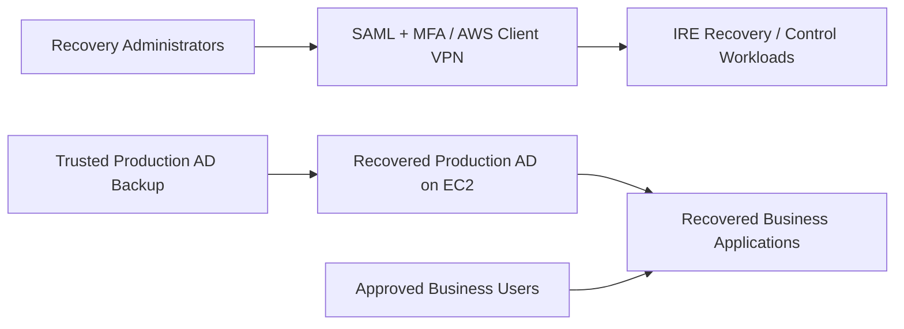
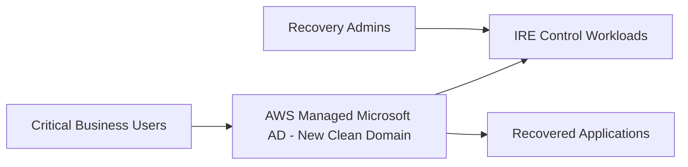
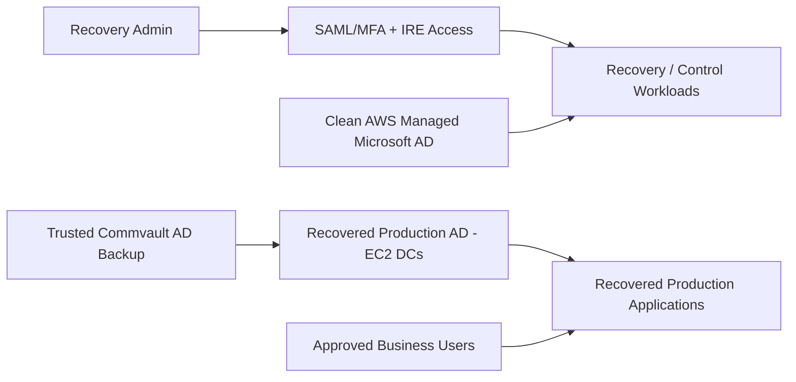
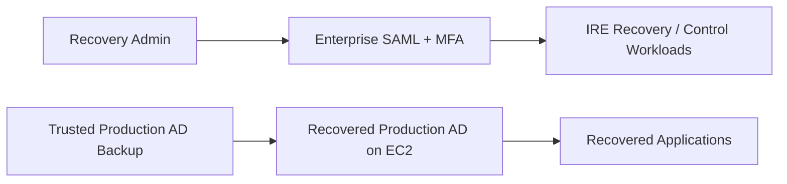
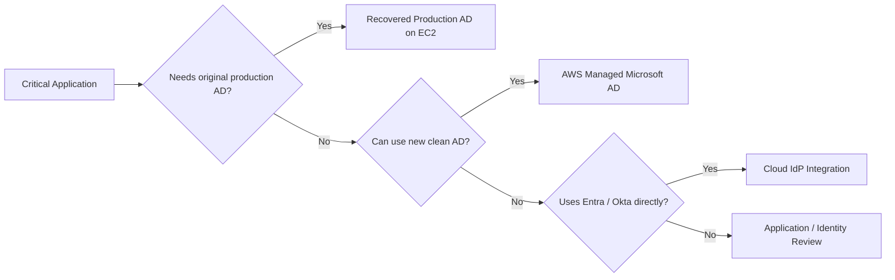
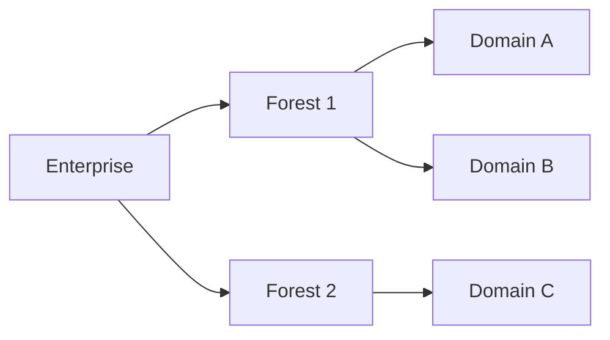
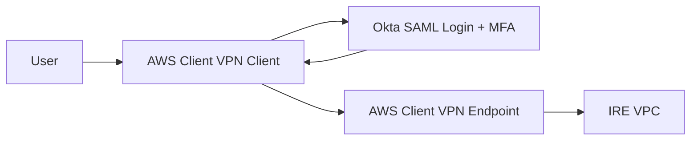
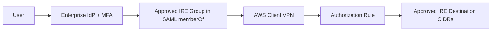
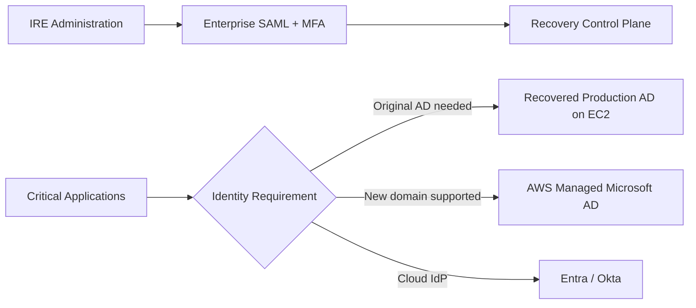

# IRE Identity Discussion Guide
## Active Directory Recovery, AWS Managed Microsoft AD, Recovered Workloads, and AWS Client VPN SAML/MFA

**Purpose:** Prepare for a 30-minute discussion with the Enterprise Identity / Active Directory team.

**Primary focus:** Active Directory and identity for recovered workloads in the AWS Isolated Recovery Environment (IRE).

**Secondary focus:** Enterprise SAML + MFA configuration for AWS Client VPN using the organization's approved identity provider (Okta, Microsoft Entra ID, or another approved SAML 2.0 IdP).

**Audience:** IRE / Cyber Recovery team, Enterprise Identity / AD team, backup/Commvault team, application owners, Security, and PMO.

> This document is intentionally written in plain language. It uses the required technical terms, but it does not assume that the IRE team is the Active Directory subject-matter expert. The goal of the meeting is to understand the enterprise identity landscape, validate the recovery approach, and identify what help is required from the Identity team.

---

# 1. Problem Statement

The IRE is intended to recover critical applications after a major outage or cyber incident.

Recovering an application is not enough. Many applications depend on identity services such as:

- Active Directory domain authentication
- Windows domain membership
- DNS provided by Active Directory
- AD groups and permissions
- service accounts
- Group Policy
- Kerberos / Windows Integrated Authentication
- LDAP
- Microsoft Entra ID or Okta SSO

Therefore, the IRE needs an identity strategy that answers two different questions:

1. **How do recovery administrators securely enter and operate the IRE?**
2. **How do recovered business applications authenticate users and services after recovery?**

These two identity needs should not automatically be treated as the same thing.

---

# 2. Our Current IRE Identity Thinking

At a high level, we currently see two identity layers.



The important distinction is:

- **Administrative identity** is used to enter and operate the IRE.
- **Recovered workload identity** is used by applications and business users after the applications are restored.

Our current architecture discussion has considered using **AWS Managed Microsoft AD** for the IRE control/recovery side and **EC2-based Domain Controllers** for production-workload identity recovery.

However, we do not want to lock that design until Enterprise Identity confirms the actual requirements.

---

# 3. The Main Decision We Need Help With

The biggest question for the Identity team is:

> **Do the critical applications we plan to recover require the original production Active Directory identity, or can they run against a completely new clean IRE domain?**

This one answer changes the entire architecture.

There are two fundamentally different patterns.

---

# 4. Pattern A — Recover the Original Production Active Directory

Suppose production uses:

```text
corp.example.com
```

If we restore Active Directory from a trusted production-domain backup into EC2-based Domain Controllers in the isolated AWS recovery environment, we are performing a **forest/domain recovery**.

The recovered domain is still:

```text
corp.example.com
```

It is not automatically changed to:

```text
ire.example.com
```

The AWS VPC, subnet, IP addresses and EC2 servers can be different, but the Active Directory forest/domain identity being recovered remains the production identity.

Example:

```text
PRODUCTION

Domain:
corp.example.com

DC1:
10.10.10.10

APP1:
10.10.20.20
```

After recovery:

```text
AWS IRE

Recovered domain:
corp.example.com

Recovered DC1:
172.20.10.10

Recovered APP1:
172.20.20.20
```

The **domain is the same**.

The **network is different**.

---

# 5. Important: New IP Addresses Do Not Mean a New AD Domain

This is an important point for our IRE design.

A recovered Domain Controller does not need to keep its old `10.x.x.x` address merely because its AD domain is being recovered.

It can run on an IRE subnet using a new private IP.

For example:

```text
Before incident:
DC1.corp.example.com = 10.10.10.10

IRE:
DC1.corp.example.com = 172.20.10.10
```

But when IP addresses change, the recovery process must deal with DNS and stale network information.

Microsoft's forest recovery guidance specifically discusses restoring Domain Controllers in isolation, changing IP addresses where necessary, and correcting DNS information during recovery.

This is an area where we need the Identity team to define the supported recovery steps.

---

# 6. What Happens to DNS When We Recover AD?

Active Directory depends heavily on DNS.

A Domain Controller is often also an Active Directory-integrated DNS server.

So a recovered DC in AWS does not simply need "an external DNS server."

It becomes part of the recovered AD DNS environment.

For a simple example:

```text
Recovered DC1

IP address:
172.20.10.10

AD domain:
corp.example.com

DNS service:
Running on recovered DC
```

The recovered AD environment must eventually contain valid records such as:

```text
dc1.corp.example.com -> 172.20.10.10
```

and the AD service records used to locate:

- LDAP services
- Kerberos services
- Domain Controllers
- Global Catalog servers

The Identity team's recovery procedure should define how this is validated and repaired after restore.

---

# 7. What Happens to a Restored Application Server?

This is just as important as recovering the DC.

Suppose APP1 originally ran in production as:

```text
APP1:
10.10.20.20

DNS configured as:
10.10.10.10
```

Commvault restores that server into AWS and it now runs as:

```text
APP1:
172.20.20.20
```

The restored workload cannot be assumed to be immediately usable.

The IRE needs a **post-restore network and identity reconfiguration stage**.

That stage may need to handle:

- new AWS private IP
- new subnet
- new default gateway
- DNS server settings
- old hard-coded IP references
- stale `/etc/hosts` entries
- Windows `hosts` file entries
- application configuration
- AD secure-channel validation
- service-account configuration
- firewall/security-group access
- route changes
- application dependencies

The backup restores the workload.

The recovery process makes the workload usable in the IRE.

---

# 8. Example — Hard-Coded Domain Controller IP

If an application contains:

```text
LDAP server = 10.10.10.10
```

and the recovered DC is:

```text
172.20.10.10
```

the application will fail until that dependency is changed.

A better application design is to use DNS names or AD discovery where supported, for example:

```text
dc1.corp.example.com
```

because DNS can then return the current IRE address:

```text
dc1.corp.example.com -> 172.20.10.10
```

One of the questions for application owners should therefore be:

> Does the application refer to Domain Controllers or other infrastructure using hard-coded IP addresses, or does it use DNS/domain discovery?

---

# 9. Linux and Windows DNS Settings

For Windows workloads, the network adapter normally needs DNS settings that allow it to resolve the recovered AD domain.

For Linux workloads joined to AD through tools such as SSSD / realmd, the system must also be able to resolve the recovered AD namespace.

Linux DNS may be controlled through:

- NetworkManager
- systemd-resolved
- DHCP
- cloud-init
- `/etc/resolv.conf`
- Route 53 Resolver / forwarding design

Therefore, our automation should not assume that directly editing `/etc/resolv.conf` is always the correct solution.

The correct approach depends on how the workload manages its networking.

---

# 10. What About the Restored Server's Existing Domain Membership?

A recovered Windows application server may already believe it belongs to:

```text
corp.example.com
```

That is useful if we are recovering the original production domain.

However, the restored application-server backup and the restored AD backup might come from different points in time.

That can create issues with the computer account / domain secure channel.

Therefore, application validation should include questions such as:

- Can the server resolve the recovered domain?
- Can it locate a Domain Controller?
- Is the domain secure channel healthy?
- Does Kerberos authentication work?
- Can application services authenticate?
- Is repair or rejoin required?

The Identity team should define the supported procedure rather than the IRE team assuming that every restored server needs to be removed and rejoined.

---

# 11. Pattern B — Create a Completely New IRE Domain

The alternative is:

```text
Production:
corp.example.com

IRE:
ire.example.com
```

This is **not the same AD recovery**.

It is a new identity environment.

For example:

```text
Production:
CORP\John

IRE:
IRE\John
```

Even though the username is similar, Windows considers them different identities because they have different security identifiers (SIDs).

That means the recovered workload may contain production-domain dependencies that do not automatically work in the new IRE domain.

Examples:

- NTFS ACLs
- Windows shares
- AD groups
- SQL Windows logins
- Windows services
- scheduled tasks
- service accounts
- SPNs
- Kerberos
- LDAP paths
- application configuration
- GPO dependencies

So "create only 500 important users in a new IRE directory" can be a very good cyber-recovery strategy **only for applications that have been proven to work with a new domain**.

---

# 12. Can We Use the On-Premises Backups if We Choose a New IRE Domain?

Yes, but we must distinguish **application backup** from **Active Directory backup**.

## Application / server / data backup

We can potentially do this:


This works if the application supports a new domain.

## Production Active Directory backup

A production AD forest backup is intended to recover the original AD state.

It should not be treated as:

```text
Restore corp.example.com backup
and rename it to ire.example.com
```

A different domain is a new-directory / migration / rebuild design.

This is one of the most important points we need Enterprise Identity to confirm.

---

# 13. Identity Architecture Options for the IRE

We currently see four practical choices.

---

# Option 1 — One Clean AWS Managed Microsoft AD for All IRE Workloads

## Concept

Create one completely new AWS Managed Microsoft AD directory, independent of production.

Example:

```text
ire.example.com
```

Use it for:

- recovery Windows servers
- recovered applications
- critical business users
- required groups
- service identities



## What problem does it solve?

It avoids having to recover the complete production AD forest just to make critical applications available.

It also creates a clean identity boundary that is independent from a potentially compromised production directory.

## Advantages

- clean domain
- AWS operates the underlying Domain Controllers
- smaller IRE user/group population possible
- no deliberate restoration of compromised production AD state
- simpler infrastructure if applications can tolerate a new domain
- good separation from production

## Disadvantages

- new SIDs
- old domain permissions do not automatically transfer
- service accounts may need recreation
- GPOs may need recreation
- application LDAP/Kerberos settings may need change
- SQL / NTFS / Windows Integrated Authentication may need remediation
- credentials for critical business users need a secure provisioning process
- cannot assume every recovered application will work

## What we need from Identity

- Can critical users be recreated/provisioned?
- How would credentials be issued?
- Which groups are needed?
- Which service accounts are needed?
- Can required GPOs be recreated?
- Can critical applications tolerate a new domain?
- Could these identities be pre-staged?

---

# Option 2 — AWS Managed AD for IRE Recovery/Control Workloads + Recovered Production AD on EC2

## Concept

Use two separate AD environments.

**AWS Managed Microsoft AD**

Used only for IRE recovery/support systems that require Windows domain services.

**Recovered production AD on EC2**

Used by recovered production applications that require the original production identity.



## What problem does it solve?

It separates the identity used to **operate the recovery environment** from the identity being **recovered for production applications**.

The IRE team does not need the compromised/recovered production AD to be working before administrators can operate recovery tools.

At the same time, applications that depend on the original domain retain the production identity structure.

## Important point

If the EC2 DCs are restored from the production AD backup as a true forest/domain recovery, the recovered domain remains the production domain.

Example:

```text
corp.example.com -> recovered as corp.example.com
```

It should not be assumed that it becomes:

```text
ire.example.com
```

## Advantages

- strong separation between recovery administration and business-workload identity
- better compatibility with legacy applications
- preserves production-domain identity where required
- reduces circular dependency
- clean AWS Managed AD can support recovery systems that genuinely need AD

## Disadvantages

- two directories to manage
- more cost and complexity
- EC2 Domain Controllers are self-managed
- forest recovery needs to be thoroughly tested
- cyber-cleanliness of AD recovery point must be established
- DNS and network reconfiguration must be handled carefully
- trust between the two directories should not be assumed

## What support we need

This option needs substantial Identity-team support for:

- forest/domain topology
- trusted recovery-point selection
- DC restore procedure
- DNS recovery
- FSMO handling
- SYSVOL/GPO recovery
- service-account validation
- domain health checks
- application-domain validation

---

# Option 3 — SAML/MFA for the IRE Control Plane + Recovered Production AD on EC2 Only

This is a simpler variation of Option 2.

If the recovery/control workloads do **not** require traditional Windows AD, there may be no reason to run AWS Managed Microsoft AD for the control plane.



## What problem does it solve?

It keeps administrative access independent from recovered production AD while avoiding an additional Windows directory that may not be required.

## Advantages

- simpler than two-AD model
- lower directory-service complexity
- admin/recovery path remains independent
- original production identity preserved for apps that need it

## Disadvantages

- enterprise IdP becomes an important recovery dependency
- emergency/break-glass access must be designed
- EC2 AD forest recovery is still required
- cannot use this if important recovery systems require Windows AD domain services

---

# Option 4 — Application-by-Application Identity Model

This may be the most realistic long-term enterprise model.

Not every Tier-0/Tier-1 application needs the same identity approach.



Possible classification:

| Class | Meaning |
|---|---|
| **A** | Requires original production AD |
| **B** | Can use a new clean IRE Windows domain |
| **C** | Uses Entra ID / Okta directly |
| **D** | Has no AD dependency |
| **E** | Unknown and requires testing |

---

# 14. Our Current Proposal — Draft for Discussion

A safe way to present our current proposal is:

> **Our working proposal is to keep IRE administrative access independent from production Active Directory. Recovery administrators will enter the IRE using enterprise SAML/MFA and AWS Client VPN. For workload identity, we want to determine whether critical applications require the original production AD identity or can operate against a clean IRE directory. Where original production identity is required, we are considering recovery of the production AD forest/domain onto isolated EC2-based Domain Controllers using a trusted Commvault recovery point. Where a clean new domain is supported, AWS Managed Microsoft AD may be a simpler option. We need the Enterprise Identity team to validate these assumptions and help us define the supported recovery procedure.**

This wording is intentional.

It does **not** pretend that the IRE team has already decided the AD recovery procedure.

---

# 15. Why We Are Proposing This Approach

The proposal is trying to solve four problems.

## Problem 1 — Recovery cannot depend on the thing being recovered

We do not want:

```text
Need production AD
to log in and run recovery
while
production AD itself needs recovery
```

Administrative access should remain independent.

---

## Problem 2 — We should not restore unnecessary identity complexity

If an application can safely run against a clean IRE domain, there may be no reason to recover the entire production forest for that application.

---

## Problem 3 — Legacy applications may require original production identity

Some applications may depend on:

- original SIDs
- service accounts
- Kerberos
- SPNs
- NTFS ACLs
- SQL Windows authentication
- production AD groups

For these applications, original production AD recovery may be safer than forcing a new domain.

---

## Problem 4 — Cyber recovery must start from trusted data

The IRE is not ordinary DR.

The selected AD backup could potentially contain compromised state.

We therefore need Identity/Security/Commvault to define:

- which recovery point is trusted
- how it is validated
- who approves the recovered directory for use

---

# 16. 40,000 Users — What We Actually Need to Understand

The number of user accounts alone does not tell us the size or complexity of Active Directory.

We should ask for the actual facts.

Required data:

- number of AD forests
- number of domains
- number of Domain Controllers
- `NTDS.dit` size
- SYSVOL size
- System State backup size
- BMR/full-server backup size
- number of groups
- number of computers
- number of service accounts / gMSAs
- number of trusts
- critical business-user count for IRE
- peak expected authentication load

We should distinguish:

```text
Directory size
```

from:

```text
Backup repository size
```

from:

```text
Number of active IRE users
```

They are not the same thing.

---

# 17. AD Terms We Need to Understand in the Meeting

## Forest

The top-level Active Directory security boundary.

A company can have more than one forest.



We need to know how many forests are relevant to the applications in IRE scope.

## Domain

Contains users, groups, computers and other identity objects.

A forest can have one domain or multiple domains.

## Domain Controller

A Windows Server running Active Directory Domain Services.

## NTDS.dit

The main AD database.

## SYSVOL

Replicated files used by AD, including part of Group Policy and scripts.

## GPO

Group Policy Object. Used to centrally configure/security Windows users and computers.

## FSMO / Operations Master roles

Five special AD roles used for operations where one authoritative owner is required.

They are roles, not huge data stores.

## Global Catalog

A directory service that helps users and systems search/find objects across a forest and is important for logon scenarios.

## SID

Security Identifier.

If a user is recreated in a new domain, the SID changes even if the username is identical.

## SPN

Service Principal Name.

Used by Kerberos to identify application/services. Important for some enterprise applications.

## Trust

Allows identities from one AD domain/forest to access resources in another.

In IRE, trust should not be created automatically because it can weaken isolation.

---

# 18. What We Need From the Enterprise Identity / AD Team

The meeting should not be:

> "Please teach us all of Active Directory."

Instead:

> "Please help us understand the enterprise identity dependencies and define the recovery method that the IRE infrastructure must support."

We need their help in five areas.

---

## Area 1 — Current Enterprise AD Topology

Ask:

1. How many AD forests exist?
2. Which forests are relevant to Tier-0/Tier-1 applications?
3. How many domains are in those forests?
4. Which is the forest-root domain?
5. How many Domain Controllers exist per domain?
6. Which DCs provide DNS?
7. Which DCs are Global Catalog servers?
8. Where are the FSMO roles?
9. Are there trusts with other forests/domains?
10. What AD sites/subnets exist?

### Why we need it

Terraform can provision AWS infrastructure.

It cannot determine which production identity boundaries the application actually needs.

---

## Area 2 — Production AD Size and Capacity

Ask:

1. Current `NTDS.dit` size?
2. Current SYSVOL size?
3. System State backup size?
4. Full DC/BMR backup size?
5. User count?
6. Group count?
7. Computer count?
8. Service-account/gMSA count?
9. Expected initial IRE users?
10. Expected authentication load?

### Why we need it

We should size from actual data and recovery demand, not guess from "40,000 users."

---

## Area 3 — Existing AD Backup and Recovery Capability

Ask:

1. What exactly does Commvault back up for AD?
2. Is it System State, full-server/BMR, VM/image, application-aware backup, or another method?
3. Which Domain Controllers are protected?
4. Is each required domain covered?
5. How long are recovery points retained?
6. Has a full forest recovery been tested?
7. Has recovery to alternate infrastructure / AWS ever been tested?
8. How is a known-good cyber recovery point chosen?
9. Who decides that the recovered AD is safe?
10. What is the expected recovery sequence?

### Why we need it

"We have AD backups" does not automatically mean "we can recover the forest into an isolated AWS environment."

---

## Area 4 — New Clean IRE Domain Feasibility

Ask:

1. Can we provision only critical business users into a new IRE domain?
2. How would credentials/passwords be securely issued?
3. Can accounts/groups be pre-staged?
4. Which service accounts would need equivalents?
5. Which GPOs are necessary?
6. Which critical applications require original SIDs?
7. Which can tolerate a new domain?
8. Are there apps dependent on Kerberos, SPNs, NTFS ACLs, LDAP paths, SQL Windows authentication, gMSAs or hard-coded domain names?

### Why we need it

This determines whether a smaller clean AWS Managed Microsoft AD is practical.

---

## Area 5 — Support During an Actual IRE Event

Ask:

1. Who from Identity participates in an IRE invocation?
2. Who selects the AD recovery point?
3. Who validates DNS/domain health?
4. Who handles FSMO/GPO/SYSVOL recovery decisions?
5. Who confirms recovered authentication is safe for applications?
6. What tasks can be automated by AAP/Terraform?
7. Which tasks must remain Identity-team controlled?
8. What approvals are required before business users are enabled?

---

# 19. Questions We Should NOT Pretend to Answer Ourselves

The IRE infrastructure team should not independently decide:

- forest recovery sequence
- authoritative/non-authoritative restore procedure
- FSMO recovery/seizure decisions
- krbtgt reset procedure
- production trust recovery
- GPO cleanup
- compromised-account cleanup
- which AD recovery point is clean
- domain/forest migration approach

Those need Identity/Security ownership.

---

# 20. What We Need From the Commvault Team

Identity and Commvault may need a follow-up session.

Questions:

- What AD-aware recovery capabilities are configured?
- What is included in the backup?
- Which domains/DCs are protected?
- What is the restore method to AWS EC2?
- Can different AWS network/IP settings be used during restore?
- What is the expected restore time?
- How are backup copies isolated/immutable?
- Can an older recovery point be selected?
- Has the process been tested?
- Which post-restore steps are handled by Commvault and which must be handled by our automation?

---

# 21. Post-Restore Automation We Expect the IRE to Need

Even if Commvault successfully restores the DC and application servers, the recovery orchestration will likely need a post-restore stage.


Possible automation tasks:

### Recovered DC

- attach/use IRE network
- apply approved recovery IP configuration
- establish/validate DNS
- remove stale DNS references as directed by Identity
- validate AD health
- validate replication when additional DCs are introduced

### Recovered workload

- use correct IRE subnet
- set approved DNS resolvers
- remove/update hard-coded old IP dependencies
- validate domain secure channel
- repair/rejoin only if required
- update service endpoints
- validate application authentication

The exact AD-specific commands should come from the Identity runbook.

---

# 22. AWS Client VPN — Secondary Topic for the Last Part of the Meeting

The second requirement for Enterprise Identity is the **AWS Client VPN** authentication model.

Our production requirement is:

```text
No client-certificate-only user authentication.
Use enterprise SAML SSO + MFA.
```

The AWS-side infrastructure will be created through Terraform/AAP.

The Identity team owns or supports the enterprise IdP application and MFA policy.

---

# 23. What We Already Tested in the Home Lab

A working proof of concept was completed using Okta.

The lab flow was:



The successful lab test used the AWS Client VPN SAML application model and confirmed that federated authentication works.

The enterprise question is **not** whether Okta technically works.

The enterprise question is:

> **Which IdP is approved for Fairview AWS Client VPN: Okta, Microsoft Entra ID, or another enterprise SAML provider?**

---

# 24. AWS Client VPN SAML Values the Identity Engineer May Need

AWS documents the following service-provider values for Client VPN SAML applications:

```text
ACS / callback URL:
http://127.0.0.1:35001

Audience URI:
urn:amazon:webservices:clientvpn
```

### What is `127.0.0.1:35001`?

This is localhost on the user's laptop.

The AWS-provided Client VPN client reserves TCP port `35001` to receive the SAML response after browser authentication.

This is **not an AWS VPC IP** and we do not open it in the VPC security group.

### What is the Audience URI?

```text
urn:amazon:webservices:clientvpn
```

It identifies AWS Client VPN as the intended SAML service provider.

If the enterprise team uses a prebuilt AWS Client VPN catalog application, some of these values may already be configured.

---

# 25. What We Need From Enterprise Identity for Client VPN

Ask only the important questions.

1. **Which enterprise IdP do we use?**
   - Okta?
   - Microsoft Entra ID?
   - something else?

2. **Can Identity create the enterprise AWS Client VPN SAML application?**

3. **Will MFA / Conditional Access be mandatory?**

4. **Can Identity provide the SAML federation metadata XML or metadata URL?**

5. **Which enterprise group should be allowed to access the IRE?**

Example concept:

```text
AWS-IRE-Recovery-Admins
```

6. **Can the SAML assertion provide the `memberOf` group attribute required for group-based AWS Client VPN authorization?**

7. **Who owns user/group assignment and removal?**

8. **Who owns SAML signing-certificate rotation?**

9. **Who creates/owns the AWS IAM SAML provider?**
   - Identity/IAM team?
   - Terraform/AAP?
   - existing shared provider?

10. **What is the emergency-access approach if the normal IdP is unavailable during a cyber event?**

---

# 26. Client VPN Authorization — Enterprise Recommendation

Do not grant every successfully authenticated employee access to the IRE.

Use group-based authorization.

Concept:



The principle is:

> Authentication proves who the user is. Authorization decides what that user can reach.

AWS Client VPN authorization should therefore be restricted to the approved identity group and the required IRE destination networks.

---

# 27. Does Our Terraform/AAP Pattern Support Enterprise SAML?

Our intended enterprise pattern is:

```text
Identity Team
    provides/owns enterprise SAML application
            +
    MFA / group assignment / SAML metadata

AWS IAM / Platform
    creates or provides SAML provider ARN

AAP
    supplies environment-bound values

Terraform
    creates Client VPN endpoint
    target network associations
    authorization rules
```

The important inputs include:

```text
server_certificate_arn
saml_provider_arn
```

The server TLS certificate and the IdP SAML signing certificate are two different things.

AWS Client VPN still requires its endpoint/server certificate even when user authentication is SAML-based.

---

# 28. Entra ID / Okta Authenticated Business Applications — Can We Ignore Them?

**Do not spend most of this 30-minute meeting on them, but do not assume there is zero identity work.**

If an application uses Entra ID or Okta directly, it may not require Windows AD recovery.

However, later we must confirm:

- are the users cloud-only or synchronized from on-prem AD?
- does authentication depend on AD FS or another on-prem component?
- does Entra/Okta depend on on-prem agents?
- does the recovered app need a different SAML/OIDC callback URL?
- are certificates/secrets/application registrations available?
- will Conditional Access allow access from the IRE?
- what is the emergency-access model?

For today's meeting, one question is enough:

> **For critical applications that authenticate directly through Entra ID or Okta, can we treat the enterprise cloud IdP as the recovery identity source, or are there on-prem AD/federation dependencies that we need to include in the IRE design?**

Record the answer and schedule deeper follow-up if required.

---

# 29. Recommended 30-Minute Meeting Flow

The meeting is short, so keep it focused.

## 0–3 minutes — Explain the problem

Say:

> We are building the AWS Isolated Recovery Environment for critical application recovery. We need to decide what identity services recovered applications require and what AD recovery capability already exists. We have some working architecture ideas, but we do not want to prescribe an AD recovery design without the Identity team's guidance.

---

## 3–8 minutes — Understand the enterprise AD landscape

Ask:

- How many relevant forests?
- How many domains?
- Which forests/domains support the applications in IRE scope?
- How many DCs are involved?
- Are there major trusts or dependencies we need to know about?

Do not spend time debating detailed FSMO commands.

---

## 8–17 minutes — Understand AD recovery

Ask:

- What is backed up by Commvault?
- Is complete forest/domain recovery supported/tested?
- Can it be recovered onto isolated AWS EC2 infrastructure?
- Does Identity agree that a true restore retains the original production domain identity?
- How are DNS/IP changes handled when restored into the IRE network?
- How is a trusted recovery point selected?
- Who validates the recovered directory?

This should be the largest part of the meeting.

---

## 17–23 minutes — Discuss the IRE identity options

Present:

### Option A
Clean AWS Managed Microsoft AD for applications that can use a new domain.

### Option B
AWS Managed AD for recovery/control systems + recovered production AD on EC2 for applications requiring original identity.

### Option C
No AWS Managed AD for control plane if SAML/MFA/IAM is sufficient; recover production AD only where needed.

Then ask:

> Based on our actual application and AD dependencies, which pattern does Identity recommend we validate first?

---

## 23–27 minutes — Confirm actions / ownership

Ask:

- Who can provide AD topology?
- Who can provide recovery/backup information?
- Who owns the AD recovery runbook?
- Who should join a follow-up with Commvault?
- Which application should we use for the first IRE identity POC?

---

## 27–30 minutes — AWS Client VPN

Say:

> Separately, administrative access to IRE will use AWS Client VPN with enterprise SAML and MFA. I validated the flow in my lab using Okta. We need to know the approved Fairview enterprise IdP and the process for getting the SAML application, group claim, metadata and MFA policy configured.

Ask:

- Entra ID or Okta?
- Who creates the SAML application?
- Which group should be assigned?
- `memberOf` available?
- metadata XML/URL?
- MFA / Conditional Access?
- certificate-rotation owner?
- emergency-access method?

---

# 30. Short Opening Script

> We are designing the identity recovery piece of the AWS IRE. Our main question is whether critical recovered applications need their original production Active Directory identity or whether they can operate against a clean IRE directory. If the original identity is required, our understanding is that we would need a supported recovery of the existing forest/domain into isolated EC2-based Domain Controllers, including the required DNS and post-restore network changes. If applications can use a new identity domain, AWS Managed Microsoft AD could be a simpler clean recovery option. We need your team's help to validate the enterprise AD topology, current Commvault recovery capability, application identity dependencies, and the supported recovery procedure.

Then:

> At the end, I also have a smaller requirement around AWS Client VPN. We have validated SAML using Okta in a lab, and we need to know whether Fairview uses Entra ID, Okta, or another approved IdP for this enterprise integration and what inputs your team can provide.

---

# 31. Short Explanation if Asked "What Are You Proposing?"

Use this wording:

> We are not proposing to automatically recover the entire enterprise identity environment without understanding the dependencies. Our preference is to keep IRE administration independent from production AD, then classify recovered applications based on what identity they actually require. Apps that require the original production AD would use the Identity-approved forest/domain recovery path. Apps that can use a clean new domain could use AWS Managed Microsoft AD. We want to validate this model with Identity before finalizing it.

---

# 32. Information We Want to Leave the Meeting With

## Must-have

- [ ] Relevant AD forest count
- [ ] Relevant domain count
- [ ] Confirmation of which domains support IRE applications
- [ ] Current Commvault AD backup/recovery method
- [ ] Whether forest/domain recovery has been tested
- [ ] Whether recovery onto isolated AWS infrastructure is supported
- [ ] Identity-team owner for recovery procedure
- [ ] Whether original-domain recovery or clean-domain approach is preferred for critical apps
- [ ] Approved Client VPN IdP: Entra ID / Okta / other
- [ ] Identity owner for AWS Client VPN SAML application

## Useful follow-up

- [ ] NTDS.dit size
- [ ] SYSVOL size
- [ ] System State/BMR backup size
- [ ] service-account inventory
- [ ] GPO dependencies
- [ ] trust dependencies
- [ ] app-to-domain mapping
- [ ] Entra/Okta hybrid dependencies
- [ ] break-glass method
- [ ] trusted recovery-point approval process

---

# 33. Feedback / Notes Section

## Enterprise AD topology

```text
Forests:

Domains:

Forest-root domain:

Number of DCs:

DNS / Global Catalog notes:

Trusts:

Relevant Tier-0/Tier-1 apps:
```

## Backup / recovery

```text
Commvault protection method:

System State?:

BMR / full-server?:

Last forest recovery test:

AWS/alternate-site recovery tested?:

Recovery-point retention:

Who selects trusted recovery point?:

Who approves recovered AD?:
```

## Clean IRE domain

```text
Identity team supports new clean domain?:

AWS Managed Microsoft AD acceptable?:

Users/groups can be pre-staged?:

Credential approach:

Application concerns:
```

## Recovered production AD

```text
Production forest/domain recovery required?:

Same-domain recovery confirmed?:

Minimum DCs:

DNS/IP recovery considerations:

Identity owner:
```

## AWS Client VPN

```text
Approved IdP:

Entra ID / Okta / Other:

SAML application owner:

MFA / Conditional Access:

IRE access group:

memberOf claim:

Metadata owner:

Signing-certificate rotation owner:

AWS IAM SAML provider owner:

Emergency-access method:
```

---

# 34. Recommended Position After the Meeting

Do not choose a final identity architecture purely because it looks cleaner on an AWS diagram.

Choose it based on what the applications require.

The likely enterprise pattern will be:



This keeps the IRE control plane independent while allowing different recovery identity patterns for different applications.

---

# 35. Final Takeaway

The Identity discussion is **not primarily about choosing AWS Managed AD versus EC2 Domain Controllers**.

The real question is:

> **What identity must each critical application have in order to function correctly and safely after a cyber incident?**

Once that is known:

- AWS Managed Microsoft AD can be used where a clean new domain is appropriate.
- EC2-based Domain Controllers can be used where the original production forest/domain must be recovered.
- Entra ID / Okta can continue to serve applications that genuinely depend on the cloud IdP and do not require recovered on-prem AD.
- AWS Client VPN can use the enterprise-approved SAML IdP with MFA and group-based authorization.

The Enterprise Identity team is needed to validate the AD recovery method, identify the real production identity dependencies, and define the operational recovery responsibilities.

---

# 36. Reference Notes

The technical statements in this guide were checked against current official guidance:

- Microsoft Learn — Active Directory Forest Recovery:
  https://learn.microsoft.com/en-us/windows-server/identity/ad-ds/manage/forest-recovery-guide/

- Microsoft Learn — Perform initial AD forest recovery:
  https://learn.microsoft.com/en-us/windows-server/identity/ad-ds/manage/forest-recovery-guide/ad-forest-recovery-perform-initial-recovery

- AWS Directory Service — AWS Managed Microsoft AD snapshots:
  https://docs.aws.amazon.com/directoryservice/latest/admin-guide/ms_ad_snapshots.html

- AWS Client VPN — SAML 2.0 federated authentication:
  https://docs.aws.amazon.com/vpn/latest/clientvpn-admin/federated-authentication.html

- AWS Client VPN — Authorization rules:
  https://docs.aws.amazon.com/vpn/latest/clientvpn-admin/cvpn-working-rules.html

- AWS Client VPN — Client authorization:
  https://docs.aws.amazon.com/vpn/latest/clientvpn-admin/client-authorization.html
