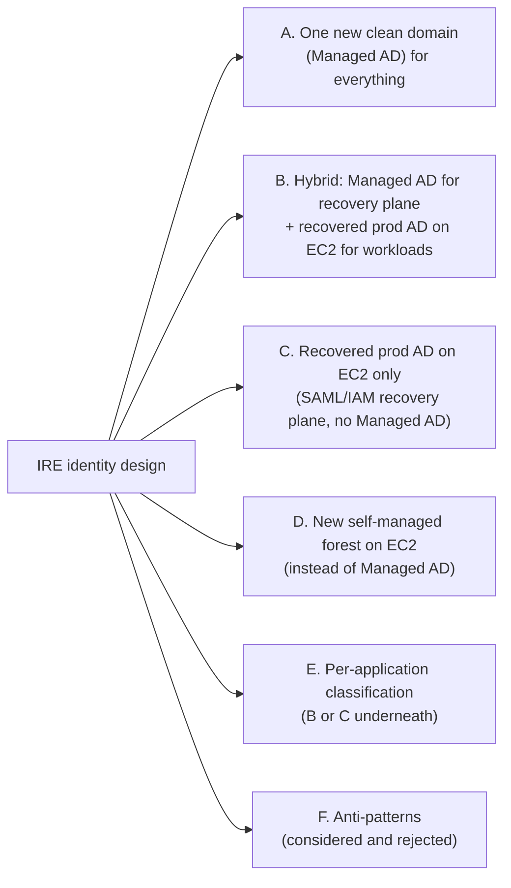
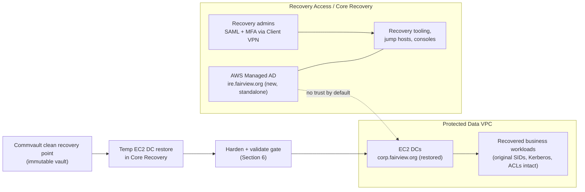
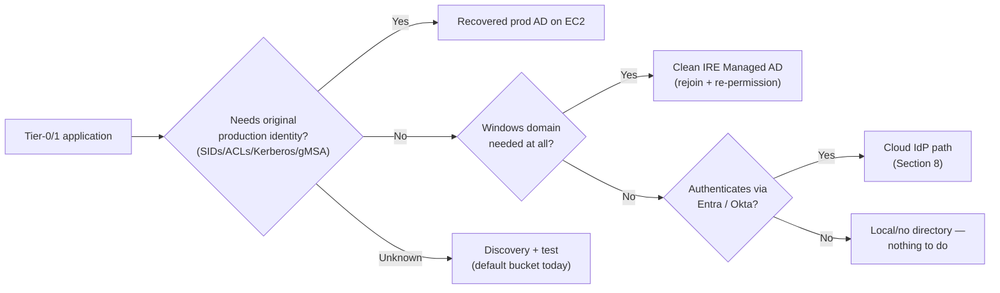
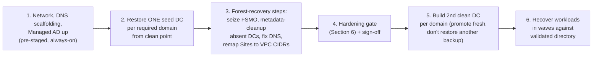
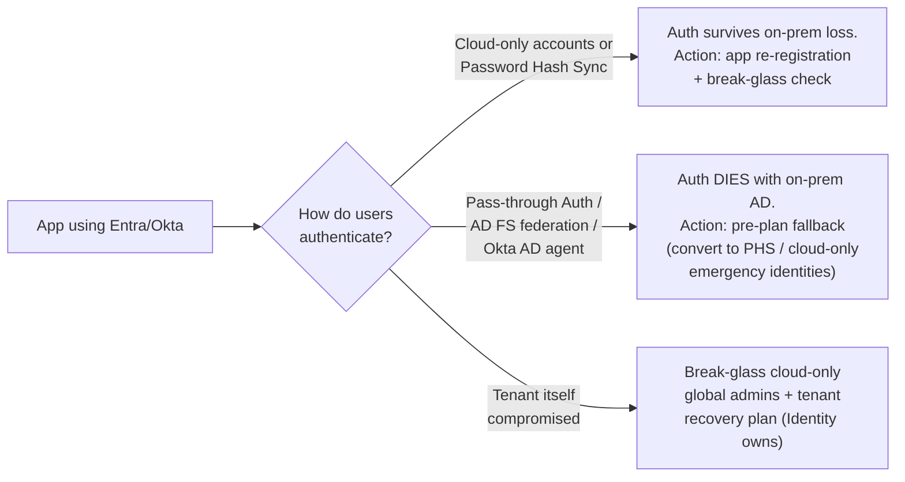

# IRE Identity Pattern — Discussion Guide for the Enterprise Identity Session

**Purpose:** Confirm the identity architecture for the Isolated Recovery Environment (IRE) on AWS: which directory serves recovery tooling, which directory serves recovered workloads, what Commvault can actually restore, and what happens to Entra ID / Okta-authenticated applications.

**Position going in:** We have a proposed pattern (Option B below). It matches the AWS and industry reference approach for cyber recovery. We are not asking Identity to design from scratch — we are asking them to **confirm inputs, own the AD recovery procedure, and classify applications**.

---

## 1. One-Page Brief (read this if you read nothing else)

**The two facts that settle most of the confusion:**

| Question | Answer |
|---|---|
| Can we restore an on-prem AD backup to EC2 and give it a new domain name? | **No.** A restore is the same forest — same domain name, same SIDs, same secrets. There is no supported restore-and-rename. If you want a different domain name, that is a *new directory build + identity migration*, not a restore. |
| If we build a new clean IRE domain, are on-prem backups useless? | **No.** Only the **AD backup** is unusable for that domain. **Application/server/data backups restore fine** — the servers are then unjoined from the dead domain and joined to the new IRE domain, *if* the application tolerates new SIDs, new service accounts, and re-permissioning. That tolerance is application-specific. |

**What we propose (Option B, hybrid):**

- **AWS Managed Microsoft AD** — brand-new domain (e.g. `ire.fairview.org`), independent of production. Serves the *recovery environment itself*: recovery tooling, jump/admin infrastructure, anything in IRE that needs Windows domain services but not production identity. Standalone, no trust to anything (consistent with our post-ARB decision to drop the production trust).
- **EC2-based domain controllers** — restored from the last known **clean** Commvault backup of production AD. This *is* the production forest (`corp.fairview.org` or whatever it is), recovered in isolation, hardened, validated, and then used by **recovered business workloads** that require their original identity (SIDs, Kerberos, NTFS ACLs, SQL Windows auth, service accounts).
- **No trust between the two directories** unless a specific application forces it, with Identity/Security approval.
- **Entra/Okta applications**: not ignored — handled as a validation-and-configuration workstream (Section 8), not a directory-recovery workstream.

**What we need from Identity today:** forest/domain inventory, confirmation of the AD backup method and whether forest recovery has ever been tested, ownership of the post-restore hardening gate, and help classifying Tier-0/1 applications into the five identity buckets (Section 9).

---

## 2. AD Vocabulary — Just Enough to Hold the Room

| Term | Plain meaning | Why it matters today |
|---|---|---|
| **Forest** | The top-level AD security boundary. Contains one or more domains sharing a schema. An organization can have **any number of forests** — many enterprises run 2–5 (corp, DMZ, acquisitions, lab). | Forest count = recovery scope. First question: how many do we have, and which contain IRE-scope apps? |
| **Domain** | A partition inside a forest holding users, computers, groups, policies. | Microsoft forest recovery restores **one DC per domain** first. More domains = more restore work. |
| **Domain Controller (DC)** | A Windows server running the directory. Production may have dozens; IRE needs the *minimum* (typically 2 per recovered domain). | We restore one seed DC per domain, then build the second cleanly. |
| **FSMO roles** | Five "one authoritative owner" roles (2 forest-wide: Schema Master, Domain Naming Master; 3 per domain: RID, PDC Emulator, Infrastructure). They are *roles, not data*. | In recovery, whichever DC we restore first must **seize** all roles, because the original role-holders don't exist in IRE. Routine step — Identity should confirm they know it. |
| **SID** | The immutable security identifier behind every user/group/computer. Permissions (NTFS, SQL, app ACLs) bind to SIDs, not names. | This is *why* a new domain breaks things: `IRE\john` is a different SID than `CORP\john` even with the same name. |
| **GPO / SYSVOL** | Centrally pushed Windows policy; stored partly in AD, partly in the SYSVOL file share replicated between DCs. | Restored forest brings its GPOs back — including any the attacker planted. A new domain needs a small hardened GPO set built fresh. |
| **krbtgt** | The hidden account whose password signs every Kerberos ticket in the domain. If an attacker ever had it, they can forge "Golden Tickets" that survive a restore. | The reason a restored AD must be **hardened before use** — double krbtgt reset is mandatory. See Section 6. |
| **Trust** | Lets one domain's identities access another domain's resources. | Convenience in normal ops; an isolation leak in IRE. Default: none. |
| **NTDS.dit** | The AD database file. Usually single-digit GB even at ~40k users — user count does not mean terabytes. | Ask for the real size instead of guessing capacity. |
| **AD Sites & Subnets** | AD's map of which network ranges belong to which location, used to route authentication to nearby DCs. | Production sites reference on-prem subnets. Recovered forest needs sites remapped to our VPC CIDRs or clients authenticate erratically. |

---

## 3. The Complete Option Space

Every realistic pattern reduces to one of these. Options A–D are single-choice architectures; **E is the honest end-state** (a classification that uses B or C underneath); F lists patterns to reject explicitly.

### Option A — One new clean AWS Managed AD for the entire IRE

New domain, no production AD restore at all. All recovered servers are unjoined/rejoined and re-permissioned.

**Pros**
- Cleanest possible identity boundary — zero attacker-controlled directory state enters IRE.
- AWS operates the DCs (patching, replication, multi-AZ).
- Small identity population — only who and what recovery actually needs.
- No dependency on AD forest-recovery skills or tested Commvault AD restores.

**Cons**
- Every restored workload gets **new SIDs**. NTFS ACLs, SQL Windows logins, service accounts, SPNs, gMSAs, scheduled tasks, hard-coded domain names — all must be remapped **per application, under incident pressure**.
- File servers with years of accumulated production ACLs are effectively unrecoverable this way.
- Requires app-by-app compatibility proof *before* the incident. Realistically, legacy Windows estates fail this.
- AWS Managed AD gives delegated admin only — no Domain Admin/Enterprise Admin, limited schema control. Apps requiring high-privilege AD operations may not install.

**Verdict:** viable only if the app inventory proves everything tolerates a new domain. For a hospital-grade legacy Windows estate, that is unlikely — but we should let the classification (Option E) prove it rather than assume.

### Option B — Hybrid: Managed AD (recovery plane) + recovered production AD on EC2 (workload plane) — *our proposal*

**Pros**
- Full identity fidelity for recovered workloads — nothing to remap; legacy apps just work.
- Recovery plane never depends on the directory being recovered (no circular dependency).
- Matches AWS prescriptive guidance and the pattern used in real Sheltered Harbor-aligned builds.
- Blast-radius separation: if the restored forest turns out dirtier than expected, the recovery plane is untouched.
- Consistent with our existing HLD (Managed AD admin-only; Commvault → temp EC2 DCs in Core Recovery → validated → promoted DCs in Protected Data).

**Cons**
- Two directories to build and operate.
- Requires a **tested** Commvault AD forest recovery — untested backup ≠ capability (the key thing to pressure-test today).
- EC2 DCs are self-managed: patching, monitoring, DNS, backup of the recovered forest itself.
- The restored forest must pass the hardening gate before any workload uses it — that gate needs an owner and criteria (Identity).

### Option C — Recovered production AD on EC2 only; no Managed AD

If nothing in the recovery plane genuinely needs Windows domain services (tooling is Linux/SaaS/IAM-based, admins use SAML+MFA+IAM), drop Managed AD entirely.

**Pros:** one less directory; lower cost; simpler story.
**Cons:** any Windows recovery-plane component needing domain join (some backup consoles, jump-host management, certain agents) has nowhere to go; admin access hangs entirely on the external IdP, so the break-glass path must be bulletproof.
**Verdict:** legitimate simplification of B. Decide by auditing the recovery plane: *does anything in it actually need AD?* If no — C. If yes or unsure — B. The delta cost of Managed AD is small; the cost of discovering mid-incident that a tool needed domain join is not.

### Option D — New self-managed IRE forest on EC2 (instead of Managed AD)

Same identity outcome as A (new domain, new SIDs) but you run the DCs yourself.
**Only worth it if** Identity requires capabilities Managed AD can't delegate (schema-heavy apps, Enterprise Admin operations, specific forest configs). Otherwise it's Option A's cons plus operational burden. Keep as a fallback if Identity rejects Managed AD's delegated model.

### Option E — Per-application classification (the honest end-state)

Whatever we pick, reality is per-application. The architecture question is just *which directories exist for apps to land on* — B gives both landing zones; A gives only one.

The classification table (Section 9) is the meeting's concrete deliverable.

### Option F — Anti-patterns we considered and rejected (say these out loud; it builds credibility)

| Rejected pattern | Why |
|---|---|
| Use the recovered production AD for IRE administration too | Circular dependency: you'd administer the recovery of AD *with* the AD you're recovering. Also hands the (possibly still-compromised) directory the keys to the recovery environment. |
| Standing warm replica DC in AWS (live replication from on-prem) | Replication faithfully copies the compromise into your "safe" copy in near-real time. The entire value of backup-based recovery is choosing an **older clean point**; a replica destroys that. |
| Two-way (or any default) trust between IRE directories, or back to production | Every trust is an isolation leak. Already ruled out by our ARB decision. Any exception must be app-specific, one-way, selective-auth, time-boxed, Security-approved. |
| Restore the AD backup "with a new name" | Not a thing. See Section 1. |
| Trust the freshest backup | Freshest may be dirtiest. Dwell time before ransomware detonation is commonly weeks; clean-point selection is a forensic decision, not a timestamp sort. |

---

## 4. Decision Matrix

| Criterion | A: Managed AD only | **B: Hybrid (proposed)** | C: Prod AD only | D: New EC2 forest |
|---|---|---|---|---|
| Legacy app compatibility (SIDs/ACLs/Kerberos) | Poor | **Strong** | Strong | Poor |
| Recovery-plane independence from prod identity | Strong | **Strong** | Depends on external IdP | Strong |
| Identity cleanliness of workload directory | Best | Gated (Section 6) | Gated | Best |
| Operational burden | Low | **Medium** | Medium | High |
| Depends on tested AD forest recovery | No | **Yes** | Yes | No |
| App re-permissioning effort at incident time | Very high | **None for prod-AD apps** | None | Very high |
| Fits our frozen HLD & ARB decisions | Partially | **Yes (already drawn)** | Mostly | No |

---

## 5. Recovery Sequence — AD Is Itself the First Recovered Workload

Nothing domain-joined recovers before the directory does. This ordering belongs in the MVS runbook:

AWS-specific items Identity/we must not forget: Route 53 Resolver rules or DHCP option sets pointing workload subnets at the EC2 DCs; time sync (Kerberos breaks beyond 5-minute skew); the restored forest's DNS zones will be full of records for servers that don't exist in IRE — expect cleanup.

---

## 6. The Part Most Documents Skip: a Restored AD Is Not Automatically Clean

In most ransomware incidents, **AD was the attack path**. Restoring even a pre-encryption backup can restore the attacker's foothold: rogue admin accounts, delegated ACLs on AdminSDHolder, malicious GPOs and logon scripts, altered adminCount objects, DSRM backdoors — and above all a **krbtgt password the attacker may hold**, which lets them forge Golden Tickets that work against the restored domain regardless of any password resets elsewhere.

So "restore, then use" is wrong. The gate between restore and use:

1. **Reset krbtgt twice** (two resets invalidate all previously issued/forged tickets).
2. **Reset every privileged account password** (Domain/Enterprise/Schema Admins, DSRM, service accounts with admin rights, trust passwords).
3. **Hunt persistence**: unexpected members of privileged groups, recently created accounts, GPO diffs, AdminSDHolder ACLs, SIDHistory anomalies, dubious SPNs/delegations.
4. **Run an AD security assessment** in the isolated bubble (Purple Knight, PingCastle, or the Identity team's tool of choice) and set a pass threshold.
5. **Named human sign-off** that the directory is fit for workloads.

**Ask Identity: who owns this gate, what tooling do they have, and what are the pass criteria?** If they don't have an answer, that's the highest-priority follow-up from today's meeting — not a reason to change the architecture.

---

## 7. What Commvault Can Actually Do (verify licensing — potentially the biggest lever in the room)

Commvault is not just "backups of DCs." Relevant capabilities to confirm with the backup team:

- **AD forest recovery runbooks** — Commvault Cloud can orchestrate and automate the full Microsoft forest-recovery procedure (the 50–100+ step sequence: seed DC restore, FSMO seizure, metadata cleanup, etc.), reducing days of manual work to hours. If we're licensed for this, we should not hand-build the EC2 DC recovery procedure.
- **Cleanroom Recovery with AWS target sites** — Commvault's cleanroom product can recover into AWS and includes automated AD health checks (Netlogon, NTDS, KDC services) post-restore. This overlaps heavily with what we're designing; even if we don't adopt it wholesale, its existence changes the build-vs-buy conversation.
- Standard questions: what exactly is captured for DCs (System State? full VM image? application-aware?), which DCs, all required domains covered, retention depth (can we reach back weeks to a clean point?), immutability of the copy, isolation of backup infrastructure credentials from production AD, and — the killer question — **has an AD restore to non-production infrastructure ever actually been tested?**

---

## 8. Entra ID / Okta Workloads — Not Ignored, Differently Handled

These are SaaS platforms; you don't recover them, Microsoft and Okta do. The exposure is different:

Concrete asks for the Identity team:

1. **Hybrid auth map**: for each IRE-scope app on Entra/Okta — are users cloud-only, PHS-synced, PTA, or federated (AD FS)? Does Okta use on-prem AD agents for delegated auth? *This single map determines whether cloud auth survives the incident.*
2. **Break-glass**: do cloud-only emergency admin accounts exist (excluded from Conditional Access, credentials vaulted offline)? Microsoft explicitly recommends these; if absent, raise it.
3. **App re-registration**: apps recovered into IRE get new URLs — their SAML/OIDC redirect/ACS URLs won't match production registrations. Who can create IRE-specific app registrations during an incident, and can metadata/certs/secrets be pre-staged in the vault?
4. **Conditional Access / device trust**: will CA policies (compliant-device requirements, named-location rules) block access *from IRE*? Pre-approve an IRE exception policy now, not at 3 a.m.
5. **Connectivity**: IRE egress to Entra/Okta endpoints — consistent with our Island Browser / restricted-egress design, needs explicit allow-listing.

So: **no directory recovery work, but a real validation-and-preparation checklist.** "Ignore" would mean discovering at incident time that every Entra app federated through a dead AD FS farm.

---

## 9. Questions for the Identity Team — With the *Why*

### A. Topology (scopes everything else)
| # | Question | Why we ask |
|---|---|---|
| 1 | How many forests and domains exist? Names? Trusts between them? | Forest count = recovery scope. Each required domain = one seed DC restore. |
| 2 | Which forests/domains do the IRE-scope (Tier-0/1) applications live in? | We may only need to recover one domain of a multi-domain estate — huge scope reduction. |
| 3 | How many DCs per domain, and where do FSMO roles sit? | Confirms they know FSMO seizure will be needed; tells us the metadata-cleanup workload. |
| 4 | NTDS.dit size, SYSVOL size, System State / DC image backup size? | Real capacity numbers for EC2/EBS sizing — user count alone is meaningless. |

### B. Recovery capability (the pressure-test)
| # | Question | Why we ask |
|---|---|---|
| 5 | What AD backup method runs today (System State, BMR, VM image, app-aware)? All required domains covered? | Not all backup types support supported forest recovery equally. |
| 6 | **Has a full forest recovery ever been tested? To non-production infrastructure?** | Untested backup is a hope, not a capability. This is the question most likely to expose the real gap. |
| 7 | Are we licensed for Commvault AD forest-recovery runbooks / Cleanroom Recovery? | Could replace months of manual runbook engineering (Section 7). |
| 8 | Who selects the "clean point," on what evidence, and how far back can retention reach? | Clean-point selection is forensic; retention must exceed plausible attacker dwell time. |
| 9 | Who owns the post-restore hardening gate (krbtgt double reset, privileged resets, persistence hunt, AD security scan) and what are its pass criteria? | Section 6 — the safety-critical step. Needs a named owner. |

### C. Pattern confirmation
| # | Question | Why we ask |
|---|---|---|
| 10 | Does Identity concur that a restored backup remains the production forest (no rename), and a new domain means migration not restore? | Locks the shared factual baseline so options aren't re-litigated later. |
| 11 | Any objection to a standalone AWS Managed AD (delegated admin, no EA/DA) for the recovery plane? | Delegated-admin model is Managed AD's main constraint; better to hear objections now. |
| 12 | Default of **no trust** between IRE directories or to production — agreed? Exceptions process? | Confirms the ARB isolation decision at the identity layer. |
| 13 | Minimum DC footprint per recovered domain acceptable to Identity (we propose: 1 restored seed + 1 freshly promoted, per domain)? | Sets the EC2 sizing and keeps IRE minimal. |

### D. Applications & cloud IdP
| # | Question | Why we ask |
|---|---|---|
| 14 | Will Identity co-own classifying Tier-0/1 apps into: (a) needs original prod AD, (b) can rejoin clean domain, (c) Entra/Okta, (d) no directory, (e) unknown? | This classification *is* the design input. Everything else is scaffolding. |
| 15 | The hybrid-auth map, break-glass status, and IRE app-registration process from Section 8 | Determines the entire Entra/Okta workstream. |

---

## 10. What Good Looks Like Walking Out of the Room

- [ ] Forest/domain count and IRE-relevant subset named
- [ ] AD backup method confirmed; forest-recovery test status known (expect: never tested — that's fine, it becomes the POC)
- [ ] Commvault forest-recovery / Cleanroom licensing question dispatched to backup team
- [ ] Hardening-gate ownership accepted by Identity (or escalation noted)
- [ ] No-rename / migration-vs-restore baseline explicitly agreed
- [ ] No objection (or specific objections) to Option B recorded
- [ ] App-classification exercise scheduled with owners named
- [ ] Entra/Okta hybrid-auth map requested with a date
- [ ] First POC agreed: restore one DC of the primary domain from a vault copy into an isolated VPC, run the hardening gate, document timings

## 11. Thirty-Second Version to Say in the Meeting

> "We propose two directories in the IRE. A brand-new standalone AWS Managed AD runs the recovery environment itself, so recovering identity never depends on the identity we're recovering. For business workloads that need their original identity — SIDs, Kerberos, file ACLs, service accounts — we restore the production forest from a clean Commvault point onto EC2 domain controllers, harden it (krbtgt resets, privileged resets, persistence scan), validate it in isolation, and only then let workloads use it. It keeps its production domain name — a restore can't be renamed, and we don't need it to be. No trust between the two, or back to production, unless a specific app forces it. Entra and Okta apps don't need directory recovery, but they need a hybrid-dependency map, break-glass accounts, and IRE app registrations prepared in advance. What we need from this team: the forest inventory, the truth about our AD restore capability, ownership of the post-restore validation gate, and help classifying the applications."
