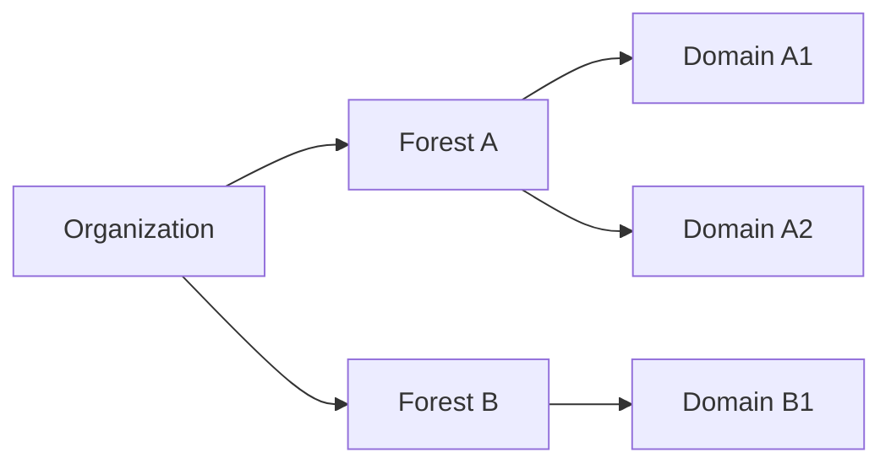
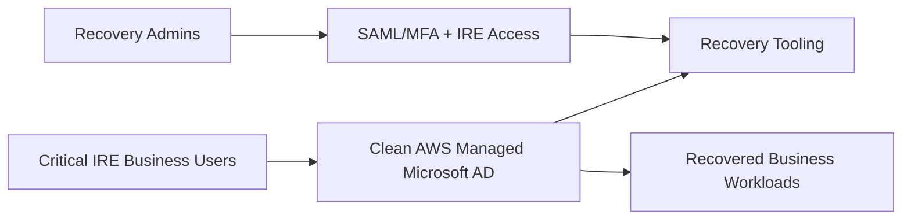
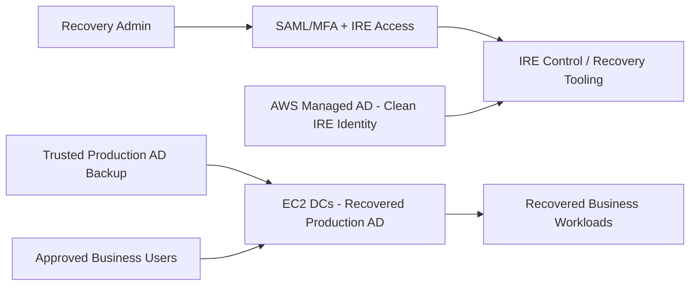
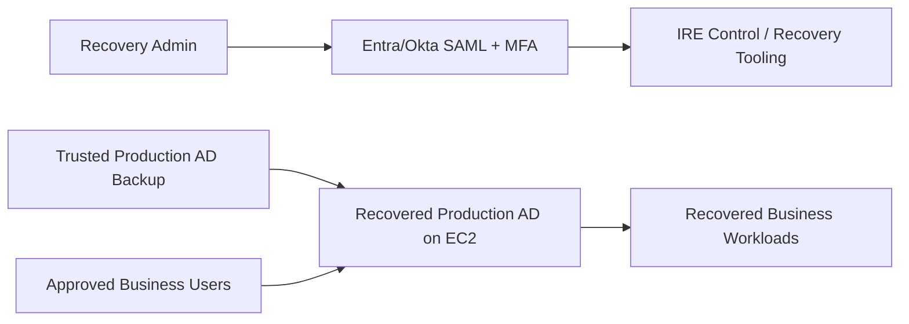
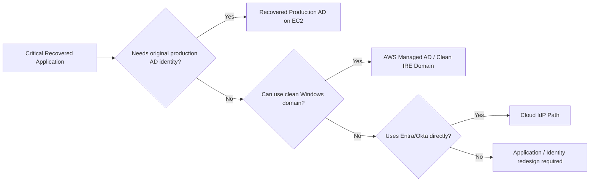
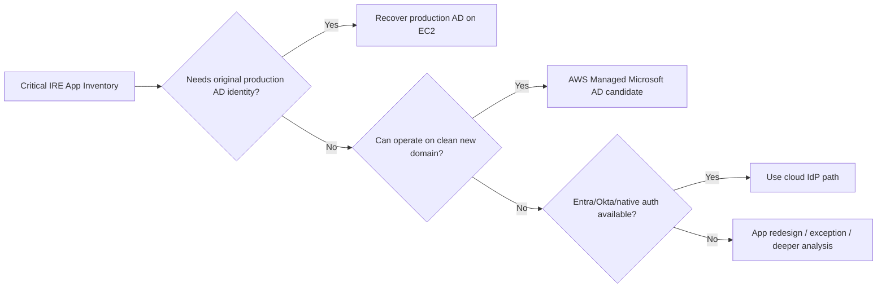

# IRE Identity Recovery Discussion Guide
## Active Directory, AWS Managed Microsoft AD, Entra ID / Okta, and Cyber-Recovery Options

**Purpose:** Prepare for the Enterprise Identity team discussion and reach a defensible identity-recovery direction for the Isolated Recovery Environment (IRE).

**Audience:** IRE architecture/engineering, Enterprise Identity, Cyber Recovery, Commvault/backup, application owners, security, and PMO.

**Important:** This is a discussion and decision guide, not an Active Directory recovery runbook. The Identity team should own or approve the detailed AD recovery procedure.

---

# 1. The Two Questions We Need to Answer Today

The meeting does **not** need to begin with FSMO, SYSVOL, Kerberos, or other deep AD details.

Start with two business/architecture questions:

1. **Do our critical recovered workloads require the original production Active Directory identity?**
2. **Can those workloads operate against a completely new, clean IRE directory instead?**

Everything else follows from these two answers.

A useful opening statement is:

> We have not locked the IRE identity design yet. We want to understand whether critical recovered applications require the original production AD identity, or whether they can operate against a clean IRE domain. We also need to understand the current AD topology, backup/recovery capability, and cloud identity dependencies before choosing the architecture.

---

# 2. The Most Important Technical Clarification

## 2.1 If we restore production AD from backup to EC2

A supported **Active Directory forest recovery** restores the existing forest/domain from a trusted backup.

Example:

```text
Before incident:
    Forest: corp.example.com
    Domain: corp.example.com

IRE forest recovery:
    Forest: corp.example.com
    Domain: corp.example.com
```

The IP addresses, AWS VPC, subnets, server host infrastructure, and number of recovered DCs can be different.

But this is still the **same recovered AD forest/domain identity**.

You should **not design on the assumption that we can restore a production DC backup and simply give it a different domain name during restore**.

If the organization wants a different IRE domain, that becomes a **new-directory / migration / identity-rebuild** problem, not a normal forest restore.

## 2.2 If we create a new IRE domain

Example:

```text
Production:
    corp.example.com

IRE:
    ire.example.com
```

This is a different AD security identity.

Even if we create `CORP\John` and `IRE\John`, Windows treats them as different security principals.

The new domain creates new user/group/computer identities and domain-specific security relationships. Therefore, a workload restored from backup might need to be:

- removed from the old domain;
- joined to the new IRE domain;
- reconfigured for new service accounts and groups;
- updated for LDAP/Kerberos settings;
- updated for file/NTFS permissions;
- updated for SQL Windows authentication;
- updated for scheduled tasks/services;
- updated for application-specific domain references.

Whether this is easy or difficult is **application-specific**.

## 2.3 Can we still use on-premises backups if we use a new IRE domain?

**Yes — but distinguish the backup type.**

### Application/server/data backups

These can still be useful:

```text
Production application backup
          ->
Restore application/server in IRE
          ->
Join/reconfigure it for new IRE domain
```

This works **if that application supports changing its identity dependencies**.

### Production AD backup

A production AD System State/BMR/forest backup is intended to recover the original directory state.

It should **not** be treated as a backup that can simply be restored as a brand-new unrelated IRE forest.

If the goal is a new IRE directory, identities must instead be pre-created, recreated, imported/migrated using a supported process, or provisioned from another trusted identity source.

That process must be defined by Enterprise Identity.

---

# 3. AD in Plain English

You do not need to become an AD engineer for the meeting.

| Term | Plain-English meaning | Why we care in IRE |
|---|---|---|
| **Active Directory (AD DS)** | Microsoft's directory for users, computers, groups, authentication, policies, and related identity data. | Many recovered Windows applications depend on it. |
| **Domain Controller (DC)** | A Windows Server running AD DS that authenticates users/computers and holds a copy of directory data. | We may need to recover or build DCs in AWS. |
| **Forest** | The top-level AD boundary. It contains one or more domains that share schema/configuration and trust relationships. | Forest count determines the overall recovery scope. |
| **Domain** | A partition within a forest that contains users, computers, groups, policies, etc. | Microsoft forest recovery requires each domain to be considered. |
| **Forest Root Domain** | The first domain created in the forest. | It is recovered first in a forest recovery and contains important forest-wide administration groups. |
| **OU** | A container used to organize users/computers and apply administration/policies. | Applications/servers may depend on OU placement and GPOs. |
| **GPO** | Centralized Windows configuration/security policy. | Recovered servers may need the original GPOs or clean IRE equivalents. |
| **SYSVOL** | Files replicated between DCs that include part of Group Policy and scripts. | Must be considered in a real AD recovery. |
| **NTDS.dit** | The main Active Directory database. | Ask for its actual size instead of estimating from user count. |
| **DNS** | Name resolution. AD depends heavily on DNS. | A recovered domain without correct DNS will not work correctly. |
| **Global Catalog (GC)** | A searchable partial view of objects across the forest. | Important for authentication and multi-domain forest operation. |
| **FSMO / Operations Master Roles** | Five special AD roles used for operations that should have one authoritative owner. | Identity team must know how these roles are handled during recovery. |
| **SID** | Windows security identifier for a user/group/computer/domain. | A new domain creates new SIDs even if names are identical. |
| **SPN** | Identifier used by Kerberos to associate a service with an account. | Legacy/business apps can break when domains or service accounts change. |
| **Trust** | Allows identities from one domain/forest to access resources in another. | Trust can help integration, but in IRE it can also weaken isolation. |
| **Schema** | Definitions of the object types/attributes stored in AD. | Forest recovery preserves it; a new directory may not have the same extensions. |
| **AD Site** | Logical mapping of AD to network locations/subnets. | AWS recovery networking may require new site/subnet definitions. |
| **Service Account** | Identity used by an application or Windows service rather than a person. | These are often harder to rebuild than normal user accounts. |

---

# 4. Forests and Domains — What Should I Know?

A company is **not limited to one forest**.



A forest can contain one domain or many domains. Organizations can have multiple forests.

The first Identity-team question should be:

> How many production forests and domains do we actually have, and which of them are required by the applications in IRE scope?

---

# 5. FSMO Roles Without the Jargon

AD normally allows changes on multiple DCs, but some operations need one authoritative DC.

Microsoft defines five Operations Master/FSMO roles.

**Forest-wide**
- Schema Master
- Domain Naming Master

There is one of each per forest.

**Domain-wide**
- RID Master
- PDC Emulator
- Infrastructure Master

There is one of each per domain.

**Capacity point:** FSMO roles are roles, not terabytes of extra data.

---

# 6. GPOs and SYSVOL Without the Jargon

A GPO is a collection of Windows settings such as firewall rules, password/security settings, user restrictions, scripts, and system configuration.

Part of a GPO is stored in AD and part in **SYSVOL**.

Ask:

- What is the actual SYSVOL size?
- Are there unusually large files/scripts/software in SYSVOL?
- Which GPOs are mandatory for critical recovered workloads?
- Could a clean IRE domain use a reduced, hardened set of IRE-specific GPOs?

---

# 7. 40,000 Users Does Not Automatically Mean Terabytes of AD

The number **40,000 users** by itself is not enough to size IRE AD.

Ask Identity/Commvault for:

- NTDS.dit size
- SYSVOL size
- System State backup size
- BMR/full-server backup size if used
- number of forests/domains/DCs
- users/groups/computers
- service accounts/gMSAs
- trusts
- peak authentication demand
- backup retention and recovery-point sizes

Separate:

```text
Live AD size
```

from:

```text
Retained backup-estate size
```

from:

```text
Active IRE user population
```

They are different capacity questions.

---

# 8. IRE / Cyber-Recovery Principles

1. **The recovery control plane must not depend on the production identity system being recovered.**
2. **Recovery data must come from a trusted/approved recovery point.**
3. **Restore and validation happen in isolation before broader connectivity is allowed.**
4. **Do not automatically create trust back to production.**
5. **Administrative access needs an independent emergency path.**
6. **Recovered applications should be enabled in controlled waves.**
7. **Do not restore more identity complexity than critical applications require unless original-domain fidelity is necessary.**
8. **Recovery procedures must be rehearsed before a real incident.**
9. **Identity, backup, cyber/security, and application teams jointly own the outcome.**
10. **Define what "clean" means and who can declare an identity recovery point safe.**

---

# 9. Sheltered Harbor / Vaulting View

Sheltered Harbor's validated AWS vaulting approach emphasizes secure, encrypted, isolated, immutable, survivable, restricted recovery data and tested recovery processes.

The vault is **not the active recovery environment**.


If AD backup data is in the cyber-recovery strategy, restore it only from an approved recovery point and validate the recovered directory before business workloads depend on it.

**AWS caution:** Do not assume a Commvault AD backup automatically fits into AWS Backup Logically Air-Gapped Vault. Validate the actual backup format/repository and supported integration. Vendor-native immutability, S3 Object Lock, or other approved patterns may be relevant.

---

# 10. Option 1 — One Clean AWS Managed Microsoft AD for the Entire IRE

Create a completely new directory independent of production, for example `ire.example.com`.

Use it for Windows recovery tooling, recovered Windows workloads, critical business users/groups, and required service identities.



## What happens to production AD backup?

It is **not directly restored into this new AWS Managed AD directory**.

AWS Managed Microsoft AD snapshots restore the AWS Managed directory that created them. AWS supports migration mechanisms such as ADMT, but migration is not the same as cyber-recovering a production forest from backup.

## Pros

- Clean identity boundary.
- No need to recover the entire production forest if apps support a new domain.
- AWS manages the underlying DC infrastructure.
- Smaller IRE identity population is possible.
- Avoids deliberately restoring production AD state.
- Good for applications that are easy to reconfigure.

## Cons

- New SIDs.
- Old production ACLs/groups are not automatically equivalent.
- Windows integrated authentication may need reconfiguration.
- SQL Windows logins may need remapping.
- Service accounts/SPNs/GPOs may need recreation.
- Hard-coded domain/LDAP dependencies can break.
- Password/credential provisioning must be designed.
- App owners must prove compatibility with a new domain.

## Ask Identity

- Can critical users/groups be securely provisioned?
- How are credentials established during a cyber event?
- Which service identities must be recreated?
- Can critical workloads tolerate new SIDs?
- Can required GPOs be recreated as clean IRE GPOs?
- Would identities be pre-staged or created after an incident?

---

# 11. Option 2 — AWS Managed AD for IRE Control Workloads + Recovered Production AD on EC2

Use two identity systems.

**Directory A:** clean AWS Managed Microsoft AD for IRE control/recovery systems that require Windows AD.

**Directory B:** self-managed EC2 DCs recovered from trusted production AD backup for business workloads requiring original identity.



## Does the EC2 recovered domain keep the production domain name?

**Yes, if this is a genuine forest/domain recovery from production AD backup.**

Example:

```text
Production:
corp.example.com

Recovered in isolated IRE:
corp.example.com
```

The AWS network and IPs can change; the recovered directory is still the production forest/domain identity.

## Pros

- Highest compatibility for legacy/domain-dependent apps.
- Preserves original directory identity from the selected recovery point.
- Better fit for existing ACL/Kerberos/service-account dependencies.
- Keeps control identity separate from workload identity.

## Cons

- Most complex option.
- Two directories to operate.
- Requires tested Microsoft/Commvault forest recovery.
- Must validate backup cleanliness.
- EC2 DCs are self-managed.
- Recovery can be slower.
- Trust between directories should not be assumed.

---

# 12. Option 3 — SAML/MFA Control Plane + Recovered Production AD on EC2 Only

Remove AWS Managed AD if recovery tooling does not actually need Windows domain services.



## Pros

- Avoids unnecessary second Windows directory.
- Control plane remains independent of production AD.
- Lower directory-service complexity.
- Preserves original AD identity for workloads that require it.

## Cons

- SAML/IdP is a critical dependency.
- Need emergency access if IdP/federation is unavailable or compromised.
- EC2 AD recovery remains complex.
- Any Windows control systems requiring domain join need another solution.

## Good fit when

- recovery tooling does not need Windows AD;
- admin access already uses resilient SAML/MFA/IAM;
- recovered business apps still require original production AD.

---

# 13. Option 4 — New Self-Managed IRE Forest on EC2

Create a new forest such as `ire.example.com` on EC2 instead of AWS Managed AD.

This is still a **new directory**, not a production AD restore.

## Pros

- Full DC/AD administrative control.
- Useful if Identity requires capabilities unavailable through AWS Managed AD.

## Cons

- Same new-SID/remapping issues as Option 1.
- More operational overhead than AWS Managed AD.
- You manage DC patching, availability, monitoring, DNS and recovery.
- Does not make the production AD backup directly restorable as a different forest.

---

# 14. Option 5 — Application-by-Application Identity Recovery

This is often the most realistic enterprise model.



| Application type | Likely pattern |
|---|---|
| Legacy Windows app with SQL Integrated Auth/domain service accounts | Recovered production AD |
| File server with extensive production NTFS ACLs | Recovered production AD |
| App that can be rejoined/reconfigured | Clean AWS Managed AD |
| Modern app using Entra SAML/OIDC | Entra path |
| App using Okta SAML | Okta path |
| App with local users and no AD dependency | No AD dependency |
| Unknown | Discovery/testing required |

---

# 15. Should We Trust the Clean IRE AD and Recovered Production AD?

AWS Managed Microsoft AD supports trusts with self-managed AD, but **do not make a trust the default IRE design**.

Ask:

> Is there a specific recovered application that requires this trust?

If yes, Identity/Security must define trust direction, selective authentication, DNS/network paths, allowed principals, creation/removal timing, and whether it is permitted during isolation.

If no, keep the directories independent.

---

# 16. Entra ID / Okta — Can We Ignore Those Applications?

**No. But they may require much less Windows AD recovery work.**

An app authenticating directly through Entra/Okta may not need recovered AD, but validate:

1. Is it truly cloud-IdP authenticated?
2. Are users cloud-only or synchronized/federated from on-prem AD?
3. Does Entra depend on AD FS, Pass-through Authentication, AD Connect, or another on-prem component?
4. Does Okta depend on on-prem agents/directories?
5. Does IRE need a separate SAML/OIDC application registration?
6. Are IRE ACS/redirect URLs different?
7. Are certificates/secrets/metadata recoverable?
8. Will Conditional Access/device requirements work in IRE?
9. Is connectivity to the IdP available?
10. What if the tenant/org itself is considered compromised?
11. Are emergency admin identities independent of on-prem AD?

Microsoft recommends independent cloud-only emergency access accounts. Therefore, "Entra app" means **cloud identity continuity must be validated**, not "ignore identity."

---

# 17. Questions to Ask Enterprise Identity

## A. Current AD landscape

1. How many AD forests do we have?
2. What are their names?
3. Which forests contain applications in IRE scope?
4. How many domains exist in each relevant forest?
5. Which is the forest root domain?
6. How many DCs exist per domain?
7. Which Windows Server versions/functional levels are used?
8. Which DCs are DNS/Global Catalog servers?
9. Where are the FSMO roles?
10. What AD sites/subnets exist?
11. What trusts exist to other forests/domains?

## B. Capacity / size

12. What is the NTDS.dit size?
13. What is the SYSVOL size?
14. What is the System State backup size?
15. What is the BMR/full DC backup size?
16. How many users/groups/computer objects are there?
17. How many service accounts/gMSAs?
18. How many business users actually need initial IRE access?
19. What is the expected authentication/load profile?

## C. Commvault / AD recovery

20. What exactly is backed up for AD: System State, BMR, VM/image, application-aware backup, or something else?
21. Which DCs are backed up?
22. Do we have a recoverable backup for every domain required?
23. What is retention?
24. How do we select an older known-good point?
25. Has full forest recovery been tested?
26. Has recovery to AWS/alternate infrastructure been tested?
27. What does Identity consider a trusted/clean recovery point?
28. Who declares recovered AD safe?
29. What is the expected recovery sequence?
30. What are RTO/RPO expectations?

## D. New clean IRE domain

31. Could we create a completely new IRE directory with only critical users/groups?
32. How would passwords/credentials be established?
33. Could users/groups be pre-staged?
34. Which production groups need IRE equivalents?
35. Which service accounts need equivalents?
36. Can critical apps tolerate new SIDs?
37. Which apps depend on NTFS ACLs, SQL Windows auth, LDAP DNs, Kerberos, SPNs, gMSAs or hard-coded domain names?
38. Can required GPOs be recreated as clean IRE policies?

## E. Original production AD recovery

39. If we restore production AD, does Identity agree it remains the same forest/domain identity?
40. Which production forests/domains are actually required for Tier-0/Tier-1 apps?
41. What is the minimum number of DCs required to establish a validated recovery state?
42. How many DCs are required for expected IRE operating load?
43. Can additional clean DCs be introduced after initial recovery?
44. What validation is required before applications use the recovered directory?

## F. Entra/Okta

45. Which critical apps authenticate directly through Entra?
46. Which use Okta?
47. What is the authoritative identity source for those users?
48. Are identities cloud-only, synchronized, federated, pass-through, etc.?
49. Does IRE need separate SAML/OIDC configuration?
50. Are required certs/secrets/metadata protected?
51. Can administrators access the IdP when on-prem AD is unavailable?
52. What is the emergency/break-glass method?
53. What happens if the cloud IdP itself is in scope of compromise?

## G. Application classification

54. Can Identity help classify each critical application as:

```text
A - Requires original production AD
B - Can use clean IRE Windows domain
C - Uses Entra/Okta directly
D - No AD dependency
E - Unknown / needs testing
```

55. Who owns final compatibility approval for each app?

---

# 18. Questions for the Commvault Team

1. What AD-specific backup method is configured?
2. Are backups application-consistent?
3. Which DCs/domains are protected?
4. Is System State included?
5. Is BMR/full-server recovery available?
6. What are actual backup sizes?
7. What are retention periods?
8. Can we select an older known-good point?
9. Are backup copies isolated from production credentials?
10. Has restore to AWS/alternate infrastructure been tested?
11. What is expected restore time?
12. What scanning/validation occurs before recovery?
13. What immutable/WORM capability protects the copy?
14. How does the repository integrate with the proposed AWS vault design?
15. Does the backup format require Commvault-native recovery infrastructure?

---

# 19. Questions for Application Owners

For each Tier-0/Tier-1 app:

1. Is the server domain-joined?
2. Does the app authenticate through AD?
3. LDAP?
4. Windows Integrated Authentication?
5. Kerberos?
6. Domain service accounts?
7. gMSAs?
8. SQL Windows authentication?
9. Windows file shares with domain ACLs?
10. Hard-coded production domain?
11. Can it move to another domain?
12. Has that been tested?
13. Can it use Entra/Okta instead?
14. What users/groups are needed in initial IRE?
15. What is its minimum viable business function?

---

# 20. Decision Matrix

| Finding | AWS Managed AD Only | Managed AD + Recovered Prod AD | SAML/MFA + Recovered Prod AD | New EC2 IRE Forest | App-by-App |
|---|---:|---:|---:|---:|---:|
| Original production SIDs required | Poor | Strong | Strong | Poor | Strong where needed |
| Legacy Windows apps | Risky | Strong | Strong | Risky | Strong |
| Clean identity desired | Strong | Strong for control plane | Clean control plane | Strong | Strong |
| Lowest directory complexity | Strong | Weak | Stronger than Opt.2 | Medium | Medium |
| AWS manages DC infrastructure | Strong | Partial | No for prod AD | No | Mixed |
| Production AD forest recovery | No | Yes | Yes | No | Only where needed |
| New domain only | Yes | No for recovered prod AD | No for recovered prod AD | Yes | Mixed |
| Mixed application estate | Limited | Good | Good | Limited | Strong |
| App discovery required | Yes | Yes | Yes | Yes | Yes |

---

# 21. Recommended Decision Order

Do **not** lock Option 1 or Option 2 before discovery.



Separately ask:

> Do the IRE control/recovery workloads themselves require Microsoft AD services?

If **no**, SAML/MFA + IAM + emergency access may be enough.

If **yes**, AWS Managed Microsoft AD is a strong candidate for a clean IRE administrative/recovery directory.

---

# 22. What to Avoid

- **"Restore the DC backup and change the domain name."** A true forest recovery restores original directory identity; a different domain is migration/rebuild.
- **"Recreate 500 users and assume every app works."** Hidden SID/Kerberos/ACL/service-account dependencies matter.
- **"40,000 users means huge TBs of AD."** Ask for actual NTDS/SYSVOL/backup sizes.
- **"Entra/Okta are cloud, so ignore them."** Validate hybrid dependencies, admin access, app integration and emergency access.
- **Using recovered production AD for IRE administration.** Avoid the circular dependency.
- **Automatically trusting recovered AD.** Validate the recovery point first.
- **Permanent trust back to production.** Justify and approve any trust/connectivity explicitly.
- **Assuming the latest backup is clean.** Cyber recovery may require an older recovery point.

---

# 23. Architecture Statements We Can Safely Use

1. **IRE administrative access will remain independent of the production AD recovery path.**
2. **Recovered workloads will use an identity pattern selected according to application dependencies.**
3. **Apps requiring original production identity will use an Identity-approved forest/domain recovery process.**
4. **Apps capable of a clean recovery identity may use a separate IRE directory.**
5. **Entra/Okta apps will be assessed for cloud/hybrid identity resilience rather than automatically requiring AD recovery.**
6. **Identity recovery data will be restored only from approved trusted recovery points.**
7. **Recovered identity services will be validated in isolation before business workloads use them.**
8. **No trust to production identity systems will be assumed by default.**
9. **Capacity will be based on actual directory size, topology, app dependency and active-user demand—not user count alone.**
10. **Identity recovery will be rehearsed with Identity and backup-platform teams.**

---

# 24. Suggested 45-Minute Meeting Agenda

**0–5 min — Purpose**

> We are trying to determine the right identity pattern for critical workloads in IRE. We want to understand what must be preserved from production AD, what can be recreated cleanly, and what identity recovery capability already exists.

**5–15 min — Current topology**

Forests, domains, DCs, critical dependencies, Entra/Okta relationship.

**15–25 min — Existing recovery capability**

Commvault backup method, tested forest recovery, trusted recovery points, minimum requirements.

**25–35 min — Architecture options**

Clean AWS Managed AD, recovered production AD, SAML/IAM-only control plane, mixed app-by-app model.

**35–42 min — Gaps**

Unknown apps, trusts, restore tests, backup facts, cloud IdP dependencies.

**42–45 min — Actions**

Owner, required evidence, follow-up date, first app/identity POC.

---

# 25. Meeting Notes / Feedback Template

## Identity topology

```text
Number of forests:
Forest names:

Forest 1:
  Root domain:
  Other domains:
  Number of DCs:
  Relevant IRE applications:

Forest 2:
  Root domain:
  Other domains:
  Number of DCs:
  Relevant IRE applications:
```

## Capacity

```text
NTDS.dit size:
SYSVOL size:
System State backup size:
BMR/full DC backup size:
User count:
Group count:
Computer count:
Service-account/gMSA count:
```

## Recovery

```text
Backup method:
DCs backed up:
Domains covered:
Retention:
Last restore test:
Forest recovery tested?:
AWS/alternate infrastructure restore tested?:
Trusted recovery point owner:
Expected RTO:
Expected RPO:
```

## Clean IRE domain

```text
Supported by Identity?:
Proposed forest/domain:
Critical users can be provisioned?:
Credential strategy:
Critical groups:
Critical service accounts:
GPO strategy:
Known application concerns:
```

## Entra / Okta

```text
Primary enterprise IdP:
Cloud-only vs hybrid:
AD FS / PTA / PHS / AD Connect dependencies:
Okta on-prem dependencies:
Emergency access method:
IRE SAML/OIDC configuration needs:
```

## Application classification

| Application | Original AD required? | New IRE domain possible? | Entra/Okta? | Service accounts? | Owner | Test? |
|---|---|---|---|---|---|---|
| | | | | | | |
| | | | | | | |

---

# 26. Answers Needed Before Final Design

- [ ] Number of relevant forests/domains known
- [ ] Tier-0/Tier-1 app-to-domain mapping known
- [ ] Commvault AD recovery method known
- [ ] AWS/isolated restore support understood
- [ ] Actual AD/backup sizes known
- [ ] Minimum viable recovered AD footprint known
- [ ] Apps needing original SID/domain identified
- [ ] Apps capable of clean domain identified
- [ ] Entra/Okta apps and dependencies identified
- [ ] Control-plane AD requirement confirmed
- [ ] Break-glass model confirmed
- [ ] Trusted recovery-point owner confirmed
- [ ] Recovered-AD approval criteria defined
- [ ] App identity test owners assigned
- [ ] First identity recovery POC selected

---

# 27. Red Flags to Listen For

- **"We don't know how many forests/domains."** Identity discovery is incomplete.
- **"We back up AD, so recovery is covered."** Ask when full forest recovery was last tested.
- **"Restore and rename the domain."** Ask for the supported Microsoft method.
- **"All apps can use the new domain."** Ask for app-owner validation.
- **"Entra is cloud, so no plan needed."** Ask about tenant/admin/federation dependencies.
- **"IRE admin can use recovered production AD."** Circular dependency.
- **"We'll use the latest backup."** Latest may not be the cleanest.
- **"We'll trust IRE back to production."** Ask why and whether isolation is weakened.

---

# 28. Practical POCs After the Meeting

### POC A — Clean-domain app

```text
Restore one application
-> join to clean IRE directory
-> recreate required group/service account
-> validate authentication
```

### POC B — Production-domain-dependent app

```text
Recover isolated production AD test copy
-> validate AD
-> restore one application
-> validate original identity dependencies
```

### POC C — Entra/Okta app

```text
Restore application
-> configure IRE SAML/OIDC integration
-> validate user and emergency-admin access
```

---

# 29. Short Version to Say in the Meeting

> We see two main workload identity patterns. If an application can operate against a clean new domain, AWS Managed Microsoft AD could provide a smaller independent IRE directory containing only the users, groups and service identities required for recovery. If an application depends on its original production domain identity, then we need an Identity-team-approved recovery of the production AD forest/domain onto self-managed domain controllers in the isolated environment. We do not want to assume that a production AD backup can simply be restored under a different domain name. For Entra/Okta applications, we need to confirm cloud and hybrid identity dependencies rather than automatically recovering Windows AD. We would like the Identity team to help classify the applications and define the supported recovery method.

---

# 30. Current Decision Position

**Do not finalize one directory architecture yet.**

### Control plane

Use independent administrative authentication:

```text
SAML / MFA / AWS IAM / approved emergency access
```

Add AWS Managed Microsoft AD **only if control-plane workloads genuinely require Windows domain services**.

### Recovered workloads

```text
Needs original production identity
    -> recover original production AD in isolation

Can use new clean domain
    -> AWS Managed Microsoft AD candidate

Uses Entra/Okta directly
    -> validate cloud identity resilience/integration

No AD dependency
    -> no Windows directory required
```

---

# 31. Official Source Basis

Prepared using current official guidance from:

- Microsoft Learn — Active Directory Forest Recovery.
- Microsoft Learn — AD logical model, forests/domains/OUs.
- Microsoft Learn — FSMO / Operations Master roles.
- Microsoft Learn — Group Policy / SYSVOL.
- Microsoft Learn — Entra emergency access and tenant recoverability.
- AWS Directory Service — AWS Managed Microsoft AD, snapshots, ADMT migration and trusts.
- AWS Backup — logically air-gapped vaults, Vault Lock, restore testing.
- AWS Well-Architected — secure, isolated and validated backups.
- Sheltered Harbor — AWS validated vaulting architecture and cyber-resilience principles.
- Okta — disaster-recovery architecture.

---

# 32. Final Takeaway

The decision is **not**:

> AWS Managed AD vs EC2 Domain Controller.

The real decision is:

> **What identity does each critical recovered workload require in order to function safely during a cyber-recovery event?**

Once that is known, the AWS implementation becomes much easier to choose.
